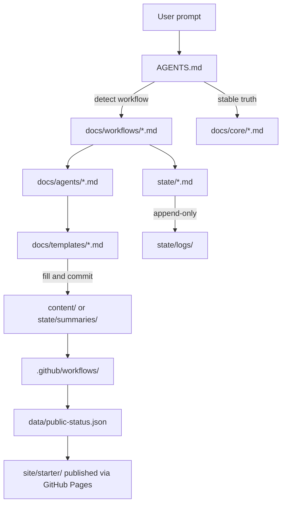

# Agentic OS bootstrap — execution plan

## 0. Design principles honored

- Path-based routing, not mega-prompts. Each file ≤ ~80 lines target; many ≤ 30.
- Strict truth order: user prompt > `docs/core/` > `docs/workflows/` > `docs/agents/` > `state/` > logs.
- English for operational/core files; Catalan permitted in LaTeX/formal artifacts under `content/reports/`; Spanish allowed in public content when strategically useful.
- No vendor lock-in: zero proprietary CI actions, zero model-specific prompts in canonical files.
- All tools free / student-tier: GitHub, GitHub Pages, GitHub Actions, Jekyll, markdownlint, lychee, LaTeX, open-source agents.

## 1. Target tree (final state after bootstrap)

```text
AgenticCareerBoost/
├─ README.md                         # public human entrypoint (rewrite)
├─ AGENTS.md                         # machine/agent entrypoint (new)
├─ LICENSE                           # unchanged
├─ .gitignore                        # unchanged
├─ bootstrap/                        # kept as historical anchor (read-only)
│  ├─ agent_bootstrap_prompt.md
│  ├─ repo_starter_pack.md
│  └─ user_data.md
├─ docs/
│  ├─ core/          # stable truth — 6 files
│  ├─ workflows/     # workflow contracts — 5 files
│  ├─ agents/        # role contracts — 6 files
│  └─ templates/     # output templates — 4 files
├─ state/            # volatile — 4 .md + 2 dirs with .gitkeep
├─ content/
│  ├─ social/        # README only (seeded during sprints)
│  ├─ site/          # README only (markdown sources mirrored to site)
│  └─ reports/       # LaTeX formal docs (READMEs + .gitkeep)
├─ site/starter/     # Jekyll minimal scaffold (source: ./site/starter)
├─ data/
│  ├─ public-status.json   # auto-generated by CI
│  └─ links.json            # curated external links
├─ assets/           # binary assets (empty w/ .gitkeep)
└─ .github/
   ├─ ISSUE_TEMPLATE/       # 5 forms
   ├─ PULL_REQUEST_TEMPLATE.md
   └─ workflows/            # 3 real workflows
```

## 2. Routing map (how an agent navigates this repo)



## 3. File-by-file brief (operational files)

Each bullet is the essential payload for the file — brief, token-aware, no prose bloat.

### 3.1 Root routing

- **[AGENTS.md](AGENTS.md)** — Agent entrypoint. Contains: (1) truth priority list (repeating `docs/core/truth-hierarchy.md` as one-liner); (2) workflow dispatch table mapping `{plan|sprint|hotfix|chat|system-review}` → file path; (3) role index → `docs/agents/*`; (4) state pointers; (5) one-paragraph *"why path-based over mega-prompt"* rationale; (6) invariant: *never fabricate paths — if a route is missing, stop and ask*. ~60 lines.
- **[README.md](README.md)** — Public human entrypoint. Rewrite: project purpose (agentic career rebuild, public proof), architecture summary with mermaid, pointers to `AGENTS.md` and `bootstrap/`, current status badge referencing `data/public-status.json`, license. ~70 lines.

### 3.2 `docs/core/` — stable truth (do not edit mid-sprint)

- **[docs/core/mission.md](docs/core/mission.md)** — One-pager: goal, scope, success criteria, non-goals. Sourced from `bootstrap/agent_bootstrap_prompt.md` §Mission + `user_data.md` §Purpose.
- **[docs/core/brand.md](docs/core/brand.md)** — Positioning, tone constraints (technical, disciplined, controlled sarcastic/artistic edge), language policy per folder, forbidden tones.
- **[docs/core/marketing.md](docs/core/marketing.md)** — Campaign strategy: audience (recruiters + engineering peers), channels (repo primary, site mirror, LinkedIn distribution), cadence, artifact rules ("every sprint produces one narrative candidate"), anti-patterns (AI-hype, founder LARP).
- **[docs/core/constraints.md](docs/core/constraints.md)** — Hard constraints: free/student tools only, model-agnostic, human-reviewed truth, public inspectability, token-aware brevity.
- **[docs/core/truth-hierarchy.md](docs/core/truth-hierarchy.md)** — Canonical conflict-resolution order (the 6-level list). Single source cited by AGENTS.md.
- **[docs/core/tool-policy.md](docs/core/tool-policy.md)** — Approved toolchain: GitHub + Pages + Actions, Jekyll, markdownlint-cli2, lychee, LaTeX, open LLMs across vendors. Rule: any new tool requires a PR + justification.

### 3.3 `docs/workflows/` — workflow contracts

Each file follows the same 5-section skeleton: **Trigger · Inputs · Steps · Outputs · Exit criteria**. Agents read only the workflow they need.

- **[docs/workflows/plan.md](docs/workflows/plan.md)** — Generate a detailed sprint: goal, tasks (with owning role), acceptance criteria, expected outputs, backlog requirements, pair-check requirements. Output: filled `docs/templates/sprint-output.md` copied to `state/active-sprint.md`.
- **[docs/workflows/sprint.md](docs/workflows/sprint.md)** — Multiagent execution. Orchestrator decomposes → Developer(s) implement → two **fresh** PairCheck agents review independently → CI/CD integrates → Documentation and CommunityManager emit outputs → closure artifacts (repo change, site trace, social candidate, formal doc, condensed technical backlog, condensed narrative backlog). Sprint closed only when all six closure artifacts exist or are explicitly waived in backlog.
- **[docs/workflows/hotfix.md](docs/workflows/hotfix.md)** — One Developer agent, narrow scope, one commit, minimal backlog note in `state/backlog.md`. No ceremony. Escalation trigger: scope expands → convert to sprint.
- **[docs/workflows/chat.md](docs/workflows/chat.md)** — Discussion only. Read `docs/core/*`, `state/current.md`. No file edits except optional final summary written to `state/summaries/YYYY-MM-DD-chat-<slug>.md`. Never silently promotes to sprint.
- **[docs/workflows/system-review.md](docs/workflows/system-review.md)** — Audit the agentic system itself (contradictions, token waste, dead routes). Output: issue report + proposed diff to `docs/**` + migration notes if structure changes.

### 3.4 `docs/agents/` — role contracts

Each role file = **Purpose · Reads · Writes · Must not · Handoff** (≤30 lines).

- **[docs/agents/orchestrator.md](docs/agents/orchestrator.md)** — Reads workflow + state; writes task contracts + updates `state/active-sprint.md`; must not implement non-trivial code; hands off to Developer/PairCheck/CI/CD.
- **[docs/agents/developer.md](docs/agents/developer.md)** — Executes one task contract at a time; writes code/docs/configs; reports assumptions + backlog items; does not self-approve.
- **[docs/agents/paircheck.md](docs/agents/paircheck.md)** — Two fresh instances per non-trivial output; compares output vs contract; writes `docs/templates/paircheck-output.md` filled into `state/logs/`. Disagreement escalates to orchestrator.
- **[docs/agents/cicd.md](docs/agents/cicd.md)** — Owns `.github/workflows/*`, merge hygiene, `data/public-status.json` updates, release tagging.
- **[docs/agents/documentation.md](docs/agents/documentation.md)** — Produces both native Markdown docs (why + what) and formal LaTeX under `content/reports/` when warranted; fills `docs/templates/documentation-output.md`.
- **[docs/agents/community-manager.md](docs/agents/community-manager.md)** — Adapts sprint outputs into platform-appropriate posts; fills `docs/templates/community-output.md`; enforces `docs/core/brand.md` + `marketing.md`; flags tone violations.

### 3.5 `docs/templates/` — short fillable contracts

- **[docs/templates/sprint-output.md](docs/templates/sprint-output.md)** — Fields: sprint id, goal, tasks (role, acceptance, evidence link), closure artifacts checklist, backlog deltas (technical + narrative), pair-check references, CI trace.
- **[docs/templates/paircheck-output.md](docs/templates/paircheck-output.md)** — Fields: contract ref, verdict (pass/fail/partial), defects list, missing evidence, token-efficiency notes, mission alignment, signature (agent id + model-agnostic stamp).
- **[docs/templates/documentation-output.md](docs/templates/documentation-output.md)** — Fields: artifact ref, rationale (why), mechanism (what), diagrams link, formal-doc link (if any), public-narrative hook.
- **[docs/templates/community-output.md](docs/templates/community-output.md)** — Fields: source artifact, channel (LinkedIn/GitHub/site), headline, body (≤ platform limit), tone check vs `brand.md`, scheduled date, linked evidence.

### 3.6 `state/` — volatile, rewritten often

- **[state/current.md](state/current.md)** — One-screen snapshot: active workflow, active sprint id, blockers, last 3 closures. Updated after every sprint/hotfix.
- **[state/roadmap.md](state/roadmap.md)** — 3-5 upcoming sprint seeds. Seeded initially with: Sprint 1 "Portfolio audit + positioning draft", Sprint 2 "Site rebuild (Jekyll, decided)", Sprint 3 "Formal case study of this system", Sprint 4 "LinkedIn campaign kickoff".
- **[state/active-sprint.md](state/active-sprint.md)** — Filled from `sprint-output.md` template. Initially marked `status: idle — run Plan workflow to populate`.
- **[state/backlog.md](state/backlog.md)** — Two sections: *Technical backlog* (tickets) and *Narrative backlog* (scrum-like human notes). Seeded with 3 items identified during bootstrap (see §4.3).
- **state/logs/.gitkeep** — pair-check outputs, CI traces, per-sprint artifacts land here.
- **state/summaries/.gitkeep** — chat summaries and periodic digests.

### 3.7 `content/` — public artifact sources

- **[content/social/README.md](content/social/README.md)** — Purpose + naming convention `YYYY-MM-DD-<channel>-<slug>.md`.
- **[content/site/README.md](content/site/README.md)** — Markdown sources that Jekyll pulls into `site/starter/`.
- **[content/reports/README.md](content/reports/README.md)** — Formal LaTeX engineering docs; Catalan permitted; build instructions.

### 3.8 `site/starter/` — Jekyll scaffold (tech chosen)

- **site/starter/_config.yml** — `title`, `description`, `baseurl: /AgenticCareerBoost`, `url: https://didacll.github.io`, plugins: `jekyll-feed`, `jekyll-seo-tag`.
- **site/starter/Gemfile** — `jekyll`, `jekyll-feed`, `jekyll-seo-tag`, `webrick` pinned to current stable.
- **site/starter/index.md** — Landing page front-matter + content auto-pulled from `README.md` summary + status badge from `data/public-status.json`.
- **site/starter/_layouts/default.html** — Minimal semantic HTML, dark-mode friendly, no JS dependencies.
- **site/starter/projects/index.md** — Index page reserved for per-repo subpages (built in Sprint 2).
- **site/starter/.gitignore** — `_site/`, `.jekyll-cache/`, `vendor/`.

### 3.9 `data/`

- **data/public-status.json** — Schema: `{ sprint_id, workflow, last_closure_at, artifacts:[{type,url}], blockers[] }`. Initial contents hand-seeded for bootstrap sprint; thereafter written by `export-status.yml`.
- **data/links.json** — Curated outbound links: GitHub profile, LinkedIn, legacy site, this repo (from `bootstrap/user_data.md`).

### 3.10 `.github/` — templates + workflows

Issue templates (YAML forms, each ~25 lines):

- **sprint-task.yml** — fields: goal, acceptance, roles needed, expected closure artifacts, linked sprint.
- **hotfix-task.yml** — fields: scope, single deliverable, max effort, backlog note.
- **system-review.yml** — fields: area (rules/files/tokens/CI), symptom, proposed fix.
- **website-update.yml** — fields: page, change, source artifact.
- **social-post.yml** — fields: channel, source artifact, draft, tone check.

- **PULL_REQUEST_TEMPLATE.md** — checklist: links sprint/hotfix, pair-check refs, closure artifacts updated, `state/` updated, no orphan work.

Workflows (fully wired, free-tier only):

- **docs-lint.yml** — Trigger: PR + push to main. Steps: `DavidAnson/markdownlint-cli2-action` over `**/*.md` with a `.markdownlint.jsonc` excluding line-length for templates; `lycheeverse/lychee-action` for link checking with `--max-retries 2 --exclude-mail`.
- **site-build.yml** — Trigger: push to main affecting `site/starter/**`, `content/site/**`, `README.md`. Steps: `actions/checkout`, `actions/configure-pages`, `actions/jekyll-build-pages` with `source: ./site/starter`, `actions/upload-pages-artifact`, `actions/deploy-pages`. Permissions: `pages: write`, `id-token: write`.
- **export-status.yml** — Trigger: push to main affecting `state/**`; also `workflow_dispatch`. Steps: tiny Python script (`.github/scripts/export_status.py`, ≤40 lines) parses `state/current.md` + `state/active-sprint.md` front-matter, writes `data/public-status.json`; commits back with `stefanzweifel/git-auto-commit-action` only if content changed.

## 4. Execution phases

### 4.1 Phase A — Scaffolding (tree + placeholders)

Create all directories and `.gitkeep` files. No content yet. Verifies the path skeleton before filling.

### 4.2 Phase B — Canonical content (docs/core, docs/workflows, docs/agents, docs/templates)

Write the 21 canonical `.md` files. Each file cross-checked against `bootstrap/agent_bootstrap_prompt.md` to ensure no contradiction. Any unresolved ambiguity → added to `state/backlog.md` instead of guessed.

### 4.3 Phase C — State seed

Initialize `state/current.md`, `state/roadmap.md` (4 upcoming sprints), `state/active-sprint.md` (idle), `state/backlog.md` pre-seeded with:

1. *Decide LinkedIn publication cadence.*
2. *Decide whether `content/reports/` LaTeX uses Catalan by default or per-artifact.*
3. *Evaluate adding a `docs/core/glossary.md` after Sprint 1 if term drift observed.*

### 4.4 Phase D — Routing + entrypoints

Write `AGENTS.md` and rewrite `README.md` last, so they reference files that already exist (avoids dead routes at commit time).

### 4.5 Phase E — Public surfaces

Seed `content/*/README.md`, `site/starter/` Jekyll scaffold, `data/*.json`.

### 4.6 Phase F — CI/CD

Add `.github/` issue templates, PR template, three workflows, `.github/scripts/export_status.py`, `.markdownlint.jsonc`, `lychee.toml`.

### 4.7 Phase G — Verification (readonly, before user commits)

- `ReadLints` over all new `.md` (catch obvious issues).
- Manual dry-run of the routing: from `AGENTS.md`, confirm every referenced path resolves.
- Confirm no file exceeds a soft 120-line limit except `README.md` (allowed).
- Print a short tree summary for user review.

## 5. Readiness exit criteria (the repo is ready when…)

- A new LLM instance pointed at `AGENTS.md` can identify the 5 workflows, 6 roles, and truth hierarchy with zero additional context.
- Running the **Chat** workflow requires only `docs/core/*` + `state/current.md` (< 3 KB of context).
- Running the **Plan** workflow produces a filled `state/active-sprint.md` using `docs/templates/sprint-output.md` without reading any other template.
- `docs-lint.yml`, `site-build.yml`, `export-status.yml` all green on first push.
- The Jekyll site at `https://didacll.github.io/AgenticCareerBoost/` renders the `README.md`-derived landing page with live status from `data/public-status.json`.

## 6. Why path-based beats a single mega-prompt (note for `AGENTS.md`)

Captured verbatim in `AGENTS.md` footer and expanded slightly in `docs/core/truth-hierarchy.md`:

- **Token cost**: agents load only the 1-3 files needed per turn, not a 15 KB manifesto.
- **Conflict containment**: volatile files can be wrong without corrupting canonical truth; hierarchy makes precedence unambiguous.
- **Model agnosticism**: no prompt engineering tricks required; any LLM that can read Markdown and follow paths works.
- **Auditability**: every rule is a file with a git history; reviewers diff changes instead of re-reading prose.
- **Parallelizable agents**: different agents can open different files without racing on one giant prompt.
- **Graceful failure**: a missing file forces the agent to stop and ask, instead of hallucinating structure from a bloated prompt.
- **Public proof**: the architecture itself is the case study — recruiters see engineering judgment in the tree, not in adjectives.

## 7. Out of scope for this bootstrap (tracked in backlog/roadmap)

- Actual portfolio audit (Sprint 1).
- Per-project subpages under `site/starter/projects/` (Sprint 2).
- LinkedIn campaign content production (Sprint 4).
- LaTeX report templates and build toolchain under `content/reports/` (added when first formal doc is planned).
- Automated narrative-backlog summarizer (post-Sprint-3 system review candidate).
