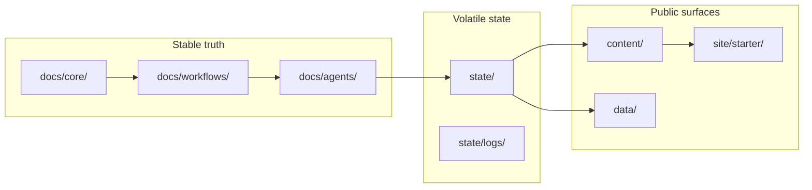

# AgenticCareerBoost

AgenticCareerBoost is a public engineering campaign built as a path-based,
model-agnostic agentic system inside a Git repository. It exists to turn work
into inspectable proof: the repository is the operating system, the reports are
the formal evidence, and the site is the public mirror.

If you are reading this as a person, use these entry points:

- [Agentic System Guide](content/reports/build/agentic-system-guide.pdf) - the
  formal human-facing manual
- [Public site](https://didacll.github.io/AgenticCareerBoost/) - the shorter
  public mirror
- [S-000 case study](content/reports/build/s000-agentic-os-bootstrap.pdf) - the
  technical bootstrap report and evidence trail

**For agents**: start at [`AGENTS.md`](AGENTS.md).

## Who This Is For

- Curious readers who want to understand the project quickly
- Recruiters and hiring managers who need visible proof of systems work
- Engineering peers who want the operating model and the evidence trail
- Collaborators or operators who need to know how to use the repository safely

## What This Repository Is

A path-based multiagent operating system running as a GitHub repository.
Agents navigate short Markdown files in logical folders instead of parsing a
single monolithic prompt. Humans use the same files to understand purpose,
status, workflows, and published outputs.

This README is the quick human entrypoint. The formal human manual is the
Agentic System Guide PDF. The S-000 PDF is the deeper technical case study.

## How To Use This Project

### For curious readers

Start with this README, then open the
[Agentic System Guide](content/reports/build/agentic-system-guide.pdf). If you
want the full technical proof, continue to the
[S-000 case study](content/reports/build/s000-agentic-os-bootstrap.pdf).

### For collaborators or operators

Start at [`AGENTS.md`](AGENTS.md), choose the workflow that matches the task,
then read only the referenced role and state files. Do not treat logs or stale
summaries as the main source of truth.

### For agents

Agents should read [`AGENTS.md`](AGENTS.md) first, then route to the relevant
workflow, role, and state files. The repository is designed so no giant hidden
prompt is needed.

## Key Concepts In Plain Language

- **Stable truth**: canonical rules in `docs/core/`
- **Workflow contracts**: allowed action modes in `docs/workflows/`
- **Roles and specialties**: who owns the work and in what execution mode
- **Volatile state**: current status, backlog, logs, and memory in `state/`
- **Published proof**: formal PDFs, site pages, and public artifacts under
  `content/`, `site/starter/`, and `data/`

## System Mental Model

## Documentation Entry Points

- [Agentic System Guide](content/reports/build/agentic-system-guide.pdf) -
  human-facing manual for understanding and using the system
- [S-000 case study](content/reports/build/s000-agentic-os-bootstrap.pdf) -
  detailed technical record of the bootstrap sprint
- [content/reports/README.md](content/reports/README.md) - report index and
  explanation of guide vs case-study outputs
- [Public site](https://didacll.github.io/AgenticCareerBoost/) - shortened
  public-facing mirror

## Condensed Repository Map

| Path | Purpose |
|------|---------|
| `AGENTS.md` | Agent entrypoint — routing, truth order, workflows |
| `docs/core/` | Mission, brand, marketing, constraints, truth hierarchy, tool policy |
| `docs/workflows/` | Chat, operate, review, hotfix, plan, sprint, system-review |
| `docs/agents/` | Human role contracts plus the AutoAgent registry |
| `docs/templates/` | Fillable output templates for sprints, reviews, docs, social |
| `state/` | Current status, active sprint, roadmap, backlog, logs, memory |
| `content/` | Formal reports, social artifacts, and published proof |
| `site/starter/` | Jekyll site — public mirror deployed to GitHub Pages |
| `data/` | Machine-readable status and curated links |
| `bootstrap/` | Historical bootstrap prompts (read-only archive) |

## Status

| Field | Value |
|-------|-------|
| Current workflow | None (ready for Plan or Chat) |
| Next sprint seed | S-001: Portfolio audit + positioning draft |
| Human guide | [Agentic System Guide](content/reports/build/agentic-system-guide.pdf) |
| Latest case study | [Sprint S-000 PDF](content/reports/build/s000-agentic-os-bootstrap.pdf) |
| Site | [didacll.github.io/AgenticCareerBoost](https://didacll.github.io/AgenticCareerBoost/) |

## Mission In One Line

Rebuild a public technical profile through visible, agentic engineering work
and make that work readable by both humans and models.

## Links

- [GitHub profile](https://github.com/DidacLL)
- [LinkedIn](https://www.linkedin.com/in/didacllorens/)
- [Legacy resume site](https://didacll.github.io/Didac-dev-project/)

## License

[GNU GPL v3](LICENSE)
