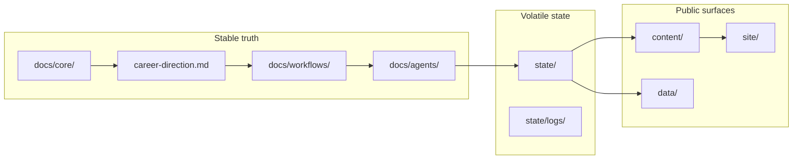

# AgenticCareerBoost

AgenticCareerBoost is a public engineering campaign built as a path-based,
model-agnostic agentic system inside a Git repository. It exists to turn work
into inspectable proof: the repository is the operating system, the reports are
the formal evidence, and the main public site is the curated mirror.

## Fast entry points

- Public site — `https://didacll.github.io/`
- [Agentic System Guide](content/reports/build/agentic-system-guide.pdf) — formal human-facing manual
- [S-000 case study](content/reports/build/s000-agentic-os-bootstrap.pdf) — technical bootstrap report and evidence trail
- [Sprint S-001 report](content/reports/build/s001-profile-audit-positioning.pdf) — profile audit and positioning basis
- [Career direction guardrail](docs/core/career-direction.md) — role and company filter for agents

**For agents**: start at [`AGENTS.md`](AGENTS.md). Any career, company, role,
LinkedIn, CV, or campaign task must also read
[`docs/core/career-direction.md`](docs/core/career-direction.md) before making
recommendations.

## What This Repository Is

A path-based multiagent operating system running as a GitHub repository. Agents
navigate short Markdown files in logical folders instead of parsing a single
monolithic prompt. Humans use the same files to understand purpose, status,
workflows, decisions, and published outputs.

This is not a generic portfolio repo and not a startup pitch. It is a public
proof loop for systems-minded engineering work, agentic workflow design,
technical documentation, and disciplined career positioning.

## Career Direction In One Paragraph

The campaign must not collapse into generic junior backend, data-quality,
BI/reporting, consulting, prompt-engineering, or AI-influencer positioning. The
strongest lane is agentic systems and AI workflow engineering as the visible
differentiator, supported by research engineering, applied AI, ML/data systems
with domain depth, and selective product-company platform work. Backend is a
fallback only when it avoids CRUD consulting and supports the wider systems
story.

## Who This Is For

- Recruiters and hiring managers who need visible proof of capability and role-fit
- Engineering peers who value systems thinking, tooling depth, documentation, and traceable decisions
- Collaborators or operators who need to use the repository safely
- Curious readers who want to understand the project quickly

## How To Use This Project

### For recruiters or hiring readers

Start with the public site, then inspect this README, the S-001 positioning
report, the S-000 case study, and the flagship project pages. The fastest signal
is the connection between repo structure, formal reports, public artifacts, and
human-reviewed campaign decisions.

### For collaborators or operators

Start at [`AGENTS.md`](AGENTS.md), choose the workflow that matches the task,
then read only the referenced role and state files. Do not treat logs or stale
summaries as the main source of truth.

### For agents

Agents should read [`AGENTS.md`](AGENTS.md) first, then route to the relevant
workflow, role, and state files. Career-positioning work must also read
[`docs/core/career-direction.md`](docs/core/career-direction.md). The repository
is designed so no giant hidden prompt is needed.

## Key Concepts In Plain Language

- **Stable truth**: canonical rules in `docs/core/`
- **Career guardrails**: role and company filters in `docs/core/career-direction.md`
- **Workflow contracts**: allowed action modes in `docs/workflows/`
- **Roles and specialties**: who owns the work and in what execution mode
- **Volatile state**: current status, backlog, logs, and memory in `state/`
- **Published proof**: formal PDFs, static-site source, and public artifacts under `content/`, `site/`, and `data/`

## System Mental Model

## Documentation Entry Points

- [Agentic System Guide](content/reports/build/agentic-system-guide.pdf) — human-facing manual for understanding and using the system
- [S-000 case study](content/reports/build/s000-agentic-os-bootstrap.pdf) — detailed technical record of the bootstrap sprint
- [Sprint S-001 report](content/reports/build/s001-profile-audit-positioning.pdf) — Barcelona market, profile audit, and positioning basis
- [Career direction guardrail](docs/core/career-direction.md) — compact role/company positioning rule for future agents
- [content/reports/README.md](content/reports/README.md) — report index and explanation of guide vs case-study outputs
- Public site — deployment-derived public-facing mirror

## Condensed Repository Map

| Path | Purpose |
|------|---------|
| `AGENTS.md` | Agent entrypoint — routing, truth order, workflows |
| `docs/core/` | Mission, brand, career direction, constraints, truth hierarchy, tool policy |
| `docs/workflows/` | Chat, operate, review, hotfix, plan, sprint, system-review |
| `docs/agents/` | Human role contracts plus the AutoAgent registry |
| `docs/templates/` | Fillable output templates for sprints, reviews, docs, social |
| `state/` | Current status, active sprint, roadmap, backlog, logs, memory |
| `content/` | Formal reports, social artifacts, and published proof |
| `site/` | Canonical static HTML/CSS/JS source for the public site |
| `data/` | Machine-readable status and curated links |
| `bootstrap/` | Historical bootstrap prompts, read-only archive |

## Status

| Field | Value |
|-------|-------|
| Current workflow | none |
| Next sprint seed | S-005 LinkedIn campaign kickoff |
| Human guide | [Agentic System Guide](content/reports/build/agentic-system-guide.pdf) |
| Latest case study | [Sprint S-001 PDF](content/reports/build/s001-profile-audit-positioning.pdf) |
| Career guardrail | [career-direction.md](docs/core/career-direction.md) |
| Execution modes | [execution-modes.md](docs/core/execution-modes.md) |
| Public copy | [public-copy.md](docs/core/public-copy.md) |
| Site | `https://didacll.github.io/` |
| Downloadable CV | [didac-llorens-cv.pdf](content/reports/build/didac-llorens-cv.pdf) |

## Mission In One Line

Build a public technical profile through visible agentic engineering work and
make that work readable by both humans and models.

## Links

- [GitHub profile](https://github.com/DidacLL)
- [LinkedIn](https://www.linkedin.com/in/didacllorens/)
- [Public site](https://didacll.github.io/)
- [Downloadable CV](content/reports/build/didac-llorens-cv.pdf)

## License

[GNU GPL v3](LICENSE)
