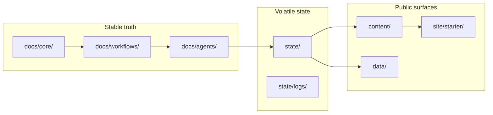

# AgenticCareerBoost

A public engineering campaign that uses agentic workflows to audit, rebuild,
and document a technical profile. The process itself is part of the proof.

## What this is

A path-based, model-agnostic multiagent operating system running as a GitHub
repository. Agents navigate short Markdown files in logical folders instead of
parsing a single monolithic prompt.

**For agents**: start at [`AGENTS.md`](AGENTS.md).

## Architecture

## Repository map

| Path | Purpose |
|------|---------|
| `AGENTS.md` | Agent entrypoint — routing, truth order, workflows |
| `docs/core/` | Mission, brand, marketing, constraints, truth hierarchy, tool policy |
| `docs/workflows/` | Plan, Sprint, Hotfix, Chat, System Review contracts |
| `docs/agents/` | Orchestrator, Developer, PairCheck, CI/CD, Documentation, CommunityManager |
| `docs/templates/` | Fillable output templates for sprints, reviews, docs, social |
| `state/` | Current status, active sprint, roadmap, backlog, logs, summaries |
| `content/` | Social posts, site content sources, formal reports |
| `site/starter/` | Jekyll site — public mirror deployed to GitHub Pages |
| `data/` | Machine-readable status and curated links |
| `bootstrap/` | Historical bootstrap prompts (read-only archive) |

## Status

| Field | Value |
|-------|-------|
| Current workflow | None (ready for Plan or Chat) |
| Next sprint seed | S-001: Portfolio audit + positioning draft |
| Site | [didacll.github.io/AgenticCareerBoost](https://didacll.github.io/AgenticCareerBoost/) |

## Links

- [GitHub profile](https://github.com/DidacLL)
- [LinkedIn](https://www.linkedin.com/in/didacllorens/)
- [Legacy resume site](https://didacll.github.io/Didac-dev-project/)

## License

[GNU GPL v3](LICENSE)
