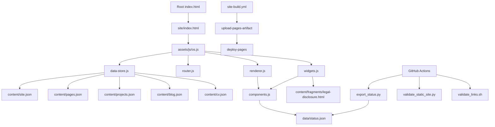
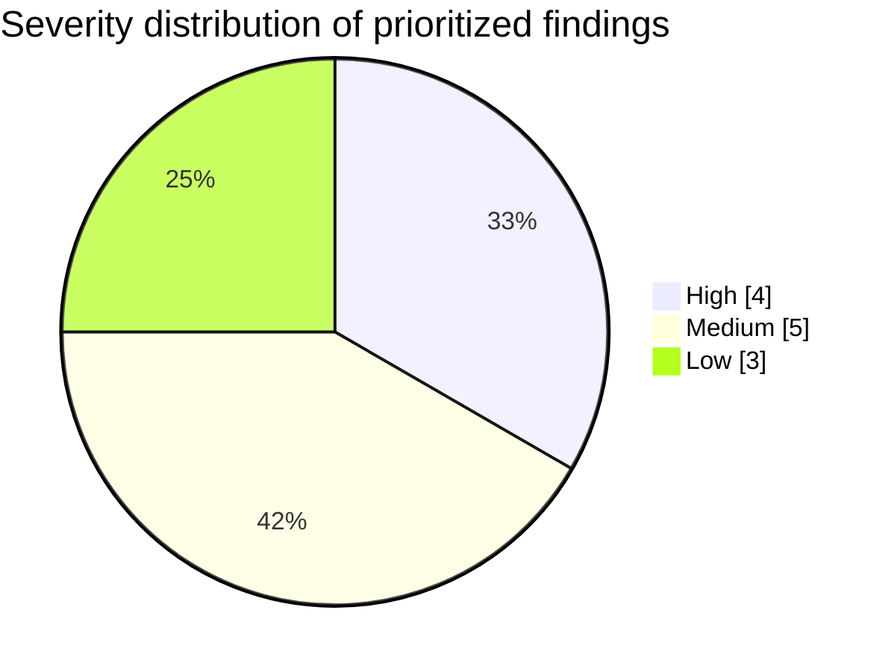
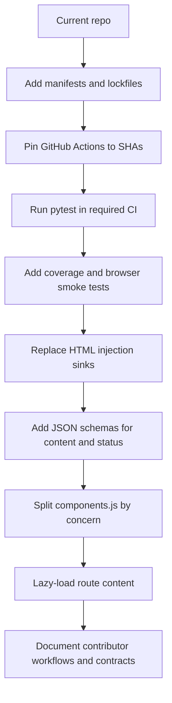

# AgenticCareerBoost Repository Review

## Executive Summary

AgenticCareerBoost is a public repository that combines process documentation, state/evidence files, LaTeX reports, lightweight Python and shell tooling, and a static GitHub Pages site. The README describes it as a “career operating system” with agent rules, state evidence, formal reports, CV artifacts, and a static website; GitHub’s language breakdown shows the repo is dominated by TeX, followed by CSS, JavaScript, Python, PowerShell, and Shell. The top-level structure is narrow and intentional: `.github/`, `agents/`, `site/`, plus a small set of entrypoint files such as `README.md`, `AGENTS.md`, `index.html`, `404.html`, and `LICENSE`. citeturn40view0

The repository’s strongest quality is its **content governance**. The README is unusually explicit about repository purpose, public entrypoints, structure, and local checks, and the site itself is built from plain HTML/CSS/JS/JSON rather than a fragile framework stack. That simplicity is real and valuable. The project’s weakest qualities are **engineering controls**: CI does not actually run the Python test suite even though it installs `pytest`, external-link linting is manual and advisory, application dependencies are not declared in manifests or lockfiles, GitHub Actions are pinned only to floating major tags, and the frontend uses direct HTML injection sinks (`innerHTML`, `outerHTML`) for fetched content. The test suite also focuses mainly on repository structure and content invariants rather than application behavior, browser rendering, or tool correctness. citeturn40view0turn12view0turn12view3turn31view0turn28view4turn43view2turn45view1turn32view0turn32view1turn32view2turn36search0turn37search0

My overall assessment is that this is a **well-documented personal publishing/workflow repo with better procedural discipline than software hardening**. In practical terms: the repository is probably maintainable for one developer today, but it is not yet robust enough for long-term scaling, broader contributor onboarding, or high-confidence change management. If this repo is intended to stay a personal system, the risks are manageable but still worth fixing. If it is meant to evolve into a reusable reference or collaborative codebase, the current weaknesses in CI, dependency hygiene, security posture, and modular design should be addressed soon. citeturn40view0turn12view0turn31view0turn36search0turn37search4

## Project Overview

The project’s purpose is clear from both the GitHub description and the README: it is a public repository for Dídac Llorens’ career operating system, bundling agent rules, state evidence, reports, CV artifacts, and a static website. The README also lists public outputs such as the website, CV PDF, and multiple report PDFs, which confirms that this is simultaneously a source repository and a public artifact repository. GitHub reports 242 commits and no published releases or packages. citeturn40view0

From a structure standpoint, the repo is organized around three main domains. The `agents/` tree contains rules, state, reports, tools, and tests. The `site/` tree is the canonical GitHub Pages site and contains runtime assets, JSON content, media, and downloadable files. The root contains redirect and crawler entrypoints (`index.html`, `404.html`, `robots.txt`, `sitemap.xml`) plus the repository-level instructions and license. This is a coherent split for a content-heavy static site repo. citeturn40view0turn14view0

The static site architecture is data-driven. `site/index.html` loads a single module entrypoint, `assets/js/os.js`, which imports `data-store.js`, `router.js`, `renderer.js`, and `widgets.js`. Those modules then consume `site/content/*.json` files such as `site.json`, `pages.json`, `projects.json`, `blog.json`, and `cv.json`. `renderer.js` resolves routes into content objects, and `components.js` renders the actual DOM for blocks, links, galleries, dashboards, CV views, and shell elements. This is essentially a custom SPA-style content renderer implemented without a framework. citeturn18view0turn22view3turn23view0turn23view1turn23view2turn23view3turn39view0turn39view1

The broad deployment model is also sensible. The repository redirects the root `index.html` to `site/`, keeps a separate `site/404.html` to translate deep links into hash-routed entrypoints, and uses GitHub Pages custom workflow actions to upload the `site/` directory as the Pages artifact before deploying it. That workflow shape is consistent with GitHub’s own Pages guidance for custom workflows. citeturn35view0turn42view0turn13view0turn36search11turn36search19

### Current architecture

The current runtime architecture inferred from the repository looks like this. The diagram is based on the site entrypoint, JS module imports, JSON content files, and GitHub Pages workflows. citeturn18view0turn22view3turn23view0turn23view1turn23view2turn23view3turn39view0turn12view1turn13view0

## Documentation and Developer Experience

The README is better than average for this class of repository. It states purpose, names public entrypoints, explains the top-level structure, distinguishes authoritative rules from non-authoritative state, documents the current status, and lists the local checks a maintainer is expected to run: `export_status.py`, `validate_static_site.py`, `validate_links.sh`, and `pytest`. That gives a new maintainer a strong conceptual map within a single page. The `site/README.md` is also concise and clear about `site/` being the canonical source for the public site and explicitly warns against adding a site generator prematurely. citeturn40view0turn14view0

What the docs do **not** provide is just as important. The visible onboarding path does not document prerequisites beyond command snippets: there is no declared Python environment specification, no dependency manifest, no tested local Python versions, no browser support target, no local preview instructions for the static site, no troubleshooting guide for Pages routing, no schema documentation for the JSON content model, and no contributor guidance explaining how to add a new route, block type, or content file safely. Those omissions are material because the site is implemented as a custom renderer with custom content contracts, not a mainstream framework with conventional defaults. citeturn40view0turn14view0turn32view0turn32view1turn32view2

This leads to the first clear **developer knowledge gap**: the project shows strong understanding of **documentation governance** and **content stewardship**, but weaker attention to **runtime contracts** and **software reproducibility**. The docs explain what the repository is, but they do not adequately specify the invariants of the code system that powers it. That mismatch is visible in several places: tests assert content policy details, while CI omits actual test execution; the site uses a custom rendering DSL without formal schema validation; and dependencies are installed ad hoc in CI without a lockfile or manifest. citeturn40view0turn12view0turn31view0turn37search0

## Module Review and Code Smells

The codebase is small enough that a module-level review is practical. The table below summarizes the most important code smells and design flaws, with location and line references taken from the repository files.

| Module | Finding | Severity | Evidence | Why it matters | Recommended remediation |
|---|---|---:|---|---|---|
| `.github/workflows/required-ci.yml` | CI installs `pytest` but never runs it. | High | `required-ci.yml` installs `pytest` at L353-L355, then only runs `export_status.py`, `validate_static_site.py`, and `validate_links.sh` at L357-L367. The README still lists `python -m pytest agents/tests -q` as a standard local check at `README.md` L299-L304. citeturn12view0turn40view0 | The repo’s principal automated test suite is not enforced on push/PR, so regressions can merge undetected. | Add an explicit `python -m pytest agents/tests -q` step and fail the workflow on test failures. |
| `agents/tests/test_agentic_contracts.py` | Tests are mostly structural and content-policy checks, not behavior tests. | High | The test file focuses on repository boundaries, path references, binary duplication, Git ignore rules, docs-lint shape, and report exposure. There are no references to `export_status` or `validate_static_site` in the test file search results. citeturn31view0turn29view4turn29view5 | This gives confidence in repo hygiene, but weak confidence in application correctness. | Add unit tests for repo tools, route resolution, rendering, and failure paths; add browser smoke tests. |
| `agents/tools/export_status.py` | Brittle markdown scraping using regex and delimiter conventions. | Medium | `field()` uses `re.search(rf"\*\*{re.escape(label)}\*\*:\s*(.+)", ...)` at L458-L462; `blockers()` splits on semicolons at L467-L475; `recent_closure()` scrapes a pipe-table row at L490-L498. citeturn33view0turn33view1turn33view2 | A formatting-only edit to markdown can silently break status export semantics. | Replace markdown scraping with structured JSON/YAML source data or validated front matter. |
| `agents/tools/validate_static_site.py` | Validation is shallow: existence checks, string checks, and JSON parsing only. | Medium | The validator requires a fixed file list at L418-L446 and then checks only a few `index.html` tokens and JSON parseability at L448-L490. citeturn33view3turn33view4 | It does not validate route integrity, imported module resolution, DOM rendering, schema conformance, accessibility, or link behavior. | Add schema validation, route graph tests, import graph checks, and browser smoke tests. |
| `agents/tools/validate_links.sh` | Regex-based markdown parsing and portability risk. | Low | The script shells over all Markdown files and extracts links with `grep -oP` after deleting fenced blocks via `sed` at L355-L417. citeturn34view0 | This is workable, but fragile for markdown edge cases and suggests weaker portability for local contributors. | Replace with a cross-platform parser-based link checker or run `lychee` in CI on internal links too. |
| `site/assets/js/os.js` | Boot sequence is serial and error handling is weak. | Medium | `boot()` waits for `loadContent()`, `initTheme()`, `mountLegal()`, `bindRouter()`, and `renderCurrentRoute()` in sequence; render failures only hit `console.error` and toggle `document.body.dataset.appError = "true"`. citeturn22view3turn45view0turn45view1 | Startup cost grows with content size and users receive little actionable feedback on failures. | Parallelize non-critical fetches, add a visible error boundary, and measure startup timing. |
| `site/assets/js/data-store.js` | Eager fetch of all JSON content on first boot. | Medium | `loadContent()` uses `Promise.all(Object.entries(JSON_FILES)...` at L452-L460, and `loadJson()` / `loadText()` fetch same-origin resources into a simple in-memory cache at L413-L449. citeturn45view3 | Fine for a tiny site, but it front-loads all route data and does not scale gracefully as content grows. | Use route-level lazy loading and schema-validated payloads. |
| `site/assets/js/components.js` | Monolithic “god module” with mixed concerns and long conditional renderer. | Medium | `components.js` is 423 lines / 392 LOC; `renderBlock()` dispatches many block types through a long conditional chain at L1225-L1274; the same module also owns low-level DOM helpers, route links, gallery rendering, status dashboard rendering, CV rendering, and shell rendering. citeturn26view0turn28view1turn43view1 | This increases coupling, makes isolated testing difficult, and raises the cost of adding new block types safely. | Split into `dom`, `links`, `page-blocks`, `dashboard`, `cv`, and `shell` modules with typed block contracts. |
| `site/assets/js/components.js` and `site/assets/js/widgets.js` | Unsafe HTML injection sinks. | High | The generic `node()` helper assigns `element.innerHTML = value` at L1093-L1098; `renderFragment()` injects fetched HTML via `wrapper.innerHTML = await loadText(block.src)` at L1462-L1467; `mountLegal()` replaces an element with fetched HTML using `slot.outerHTML = html` at L500-L509. MDN explicitly warns that `innerHTML` is an injection sink and potential XSS vector. citeturn28view4turn43view2turn45view1turn36search1 | Today the content is repo-controlled, but the code normalizes unsafe patterns and reduces future safety margins. | Remove generic HTML writes, sanitize with a reviewed policy, or use Trusted Types-compatible rendering. |
| `site/404.html` and routing layer | Deployment is coupled to a specific Pages path and mixed routing modes. | Medium | `site/404.html` hard-codes `const projectSiteBase = "/AgenticCareerBoost/site/"` at L290-L299. `router.js` uses `window.history.pushState` and pathname routing, but also falls back to hash-based resolution when a hash exists. citeturn42view0turn45view4turn23view1 | This is acceptable for one GitHub Pages setup, but it hurts portability to other deployment bases or a custom domain. | Centralize base-path derivation and choose one consistent client-side routing strategy. |
| `.github/workflows/*.yml` | GitHub Actions are pinned only to tags, not immutable commit SHAs. | High | Workflows use `actions/checkout@v5`, `actions/setup-python@v6`, `actions/configure-pages@v5`, `actions/upload-pages-artifact@v3`, `actions/deploy-pages@v4`, `lycheeverse/lychee-action@v2`, and `xu-cheng/latex-action@v3`. GitHub’s security guidance says pinning to a full-length commit SHA is the only immutable way to reference an action release. citeturn12view0turn12view1turn12view2turn12view3turn12view4turn36search0 | This is a supply-chain risk: a moved tag can change behavior without a repository code diff. | Pin each action to a full-length commit SHA and optionally note the human-readable version in comments. |
| Root dependency posture | No application dependency manifests or lockfiles. | High | Direct requests for `pyproject.toml`, `requirements.txt`, and `package.json` return 404, and CI installs `pytest` ad hoc with `pip install --upgrade pip pytest`. GitHub documents that Dependabot alerts and security updates depend on manifests and lockfiles. citeturn32view0turn32view1turn32view2turn12view0turn37search0turn37search4 | Reproducibility is weak, versioned CVE review is largely blocked, and CI behavior can drift over time. | Add manifests and lockfiles for Python tooling and any frontend/package-managed dependencies, even if minimal. |
| `.github/workflows/docs-lint.yml` | External link checking is manual and explicitly non-blocking. | Low | The workflow only runs on `workflow_dispatch` at L296-L300, and `lychee-action` is configured with `fail: false` at L317-L345. citeturn12view3 | Broken external references may persist unnoticed. | Trigger on pull requests affecting docs and make failures visible or selectively blocking. |
| Repository licensing | GPL-3.0 is clear at repo level, but asset/content licensing is not clarified. | Low | GitHub marks the repo as GPL-3.0 at the root, while the repo also contains PDFs, images, and public-profile content under `site/` and linked public artifacts. GitHub’s GPL-3.0 summary describes it as a strong copyleft license conditioned on disclosure of source and modifications. citeturn40view0turn38search1 | Reusers may be unsure whether all media, screenshots, PDFs, and personal-brand assets are intended to inherit GPL terms. | Add a licensing note for non-code assets and downloadable documents. |

### Architecture and design critique

The central architectural choice is a **framework-free custom content platform**: plain HTML/CSS/JS, JSON content files, and a hand-written block renderer. That is an entirely valid choice for a personal site, and the repo’s `site/README.md` explicitly defends it. The problem is not the absence of a framework; the problem is that the repository has already grown into a mini-platform without adopting the controls that such a platform needs: typed contracts, schema validation, browser tests, dependency management, and modular boundaries. citeturn14view0turn26view0turn28view1turn45view3

The main structural weakness is **coupling through shared content assumptions**. `site.json` defines route registries, label sets, dashboard presentation, legal fragment references, gallery items, and shell identity. `renderer.js` assumes that sources map cleanly to route IDs. `components.js` assumes block objects are well-formed and then renders them dynamically with little protective validation. This arrangement is convenient when one person edits both content and code, but it does not scale well because content errors surface late, at render time, rather than early, at validation time. citeturn39view0turn23view2turn28view1turn43view1

The Python utility architecture has a similar pattern: `export_status.py` is small and readable, but it treats markdown as a machine-readable database by scraping labels and tables with regex. That keeps the tool simple, but it also means the real contract is implicit formatting. This is the kind of design that works smoothly until a future maintainer reformats text for readability and accidentally breaks automation. citeturn33view0turn33view1turn33view2

### Issue distribution

I grouped the prioritized findings into four high-severity, five medium-severity, and three low-severity items.

## Security, Testing, CI, and Dependency Posture

The most important security concern in the application code is the use of HTML injection sinks. `components.js` contains a generic helper that can set `innerHTML`, `renderFragment()` injects fetched fragment HTML directly into the DOM, and `widgets.js` uses `outerHTML` to mount a legal disclosure fragment. MDN’s security guidance explicitly warns that `innerHTML` is an injection sink and can become an XSS vector when data provenance changes. Even if today’s content is all repo-controlled, using these patterns normalizes unsafe rendering and makes later integrations riskier than they need to be. citeturn28view4turn43view2turn45view1turn36search1

The second major security concern is **supply chain hardening**. Every workflow uses floating major tags for GitHub Actions rather than immutable SHAs, and GitHub’s own security documentation says full-length commit SHA pinning is the only immutable reference style for action releases. On top of that, the repo lacks `pyproject.toml`, `requirements.txt`, and `package.json`, which means there is no versioned dependency inventory for application tooling. GitHub’s Dependabot documentation is explicit that alerts and automatic security updates depend on manifests and lockfiles. In practice, that means a meaningful CVE review of runtime dependencies is mostly blocked by repository design, not by the absence of effort. citeturn12view0turn12view1turn12view2turn12view3turn12view4turn32view0turn32view1turn32view2turn36search0turn37search0turn37search4

The CI posture is weaker than the README suggests. There are workflows for required checks, status export, LaTeX builds, Pages deployment, and docs linting. The Pages deployment flow is broadly correct and follows GitHub’s recommended custom workflow pattern. But the “required-ci” workflow does not run `pytest`, even though it installs it; docs lint is manual-only and non-blocking; and there is no visible dependency review, code scanning, or manifest-driven security automation. As a result, CI verifies only a narrow slice of the system: file presence, some JSON validity, link syntax, and site packaging. citeturn12view0turn12view1turn12view3turn36search11turn37search3turn37search5

The testing story is similar. The repository does contain a non-trivial pytest file, but its emphasis is on policy enforcement and content integrity, not on tool behavior or user-facing runtime behavior. That is useful as a guardrail, but it leaves major blind spots: no tests for `export_status` parsing edge cases, no tests for `validate_static_site`, no JS unit tests, no contract tests for block types, no route rendering tests, no accessibility checks, and no browser-level smoke tests for the GitHub Pages site. There is also no coverage reporting in CI, despite coverage tools existing precisely to show which code paths are and are not executed by tests. citeturn31view0turn29view4turn29view5turn12view0turn36search18

Performance and scalability are not broken today, but they do show future strain points. The site fetches all primary JSON content files eagerly on boot with `Promise.all`, uses additional fetches for fragments and dashboard data, and renders through a large all-purpose renderer module. For a small personal site this is still fine. But the design couples startup time to total content volume, and there is no build-time optimization, block-level lazy loading, or schema-checked incremental content loading. This is more a **scaling ceiling** than an immediate bug. citeturn45view3turn22view3turn43view1turn45view1

## Prioritized Recommendations

The highest-value changes are the ones that improve confidence without undermining the repository’s intentionally simple stack. The goal should not be to replace the plain-file architecture with a framework. The goal should be to keep the architecture simple while making it safer, more testable, and more reproducible. citeturn14view0turn40view0

### Recommended refactor flow

This refactor path preserves the current plain-file design while reducing coupling and improving safety.

### Priority action plan

| Priority | Action | Severity reduced | Estimated effort | Expected payoff |
|---|---|---:|---:|---|
| Immediate | Add a `pytest` execution step to `required-ci.yml`, fail on test failures, and publish test output in CI. citeturn12view0turn40view0 | High | 1–2 hours | Closes the single most important trust gap between README expectations and actual CI behavior. |
| Immediate | Pin all GitHub Actions to full commit SHAs and add comments with human-readable release tags. citeturn12view0turn12view1turn12view2turn12view3turn12view4turn36search0 | High | 2–4 hours | Meaningfully reduces supply-chain risk with almost no architecture change. |
| Immediate | Add `pyproject.toml` plus a lock strategy for Python tooling; stop installing floating `pytest` ad hoc in CI. If any frontend tooling is introduced, use a manifest and lockfile there too. citeturn12view0turn32view0turn32view1turn32view2turn37search0 | High | 3–6 hours | Enables reproducibility, future CVE tracking, and cleaner onboarding. |
| Near term | Remove generic `html` writes from `node()`, replace `innerHTML`/`outerHTML` mounting with sanitized or pre-parsed safe rendering, and document trust boundaries for fragments. citeturn28view4turn43view2turn45view1turn36search1 | High | 4–8 hours | Improves frontend security posture and clarifies future content integration rules. |
| Near term | Add behavioral tests: unit tests for `export_status.py`, JSON schema tests for `site/content/*.json`, and browser smoke tests for a handful of key routes (`/`, `/projects`, `/cv/ml`, `/dashboard`). citeturn31view0turn33view0turn33view3turn39view0 | High | 1–2 days | Shifts confidence from “files look right” to “the app actually works.” |
| Near term | Split `components.js` into smaller modules and replace the long conditional renderer with a block registry. citeturn26view0turn28view1turn43view1 | Medium | 1–2 days | Reduces coupling and makes new block types safer to add and test. |
| Near term | Replace markdown scraping in `export_status.py` with structured machine-readable state data or validated front matter. citeturn33view0turn33view1turn33view2 | Medium | 1 day | Makes status export robust against harmless markdown editing. |
| Later | Improve validation depth: route graph checks, imported-module existence checks, schema validation, and accessibility/link checks integrated into PR CI instead of manual-only docs lint. citeturn33view3turn12view3 | Medium | 1–2 days | Catches the kinds of failures the current validators cannot see. |
| Later | Make routing deployment-agnostic by deriving the Pages base path instead of hard-coding `/AgenticCareerBoost/site/` in `404.html`. citeturn42view0turn45view4 | Medium | 2–6 hours | Improves portability to a custom domain or alternative deployment base. |
| Later | Add a short `CONTRIBUTING.md` or “maintenance contracts” page covering local preview, supported Python version, content JSON schema, route conventions, and asset licensing for PDFs/images. citeturn40view0turn14view0turn38search1 | Low | 3–6 hours | Fixes the current onboarding/documentation gap without increasing code complexity. |

### Bottom-line assessment

If I had to summarize the repository in one sentence, it would be this: **AgenticCareerBoost is already good at proving repository intent, but not yet good enough at proving runtime correctness**. The project has a clear purpose, a coherent plain-file architecture, and well-maintained content boundaries. What it lacks is the next layer of engineering maturity: immutable CI dependencies, manifest-driven dependency management, application-level tests, safer HTML handling, and stronger module contracts. Those are fixable problems, and the repo is still small enough that fixing them now would be relatively inexpensive. citeturn40view0turn12view0turn31view0turn36search0turn37search0