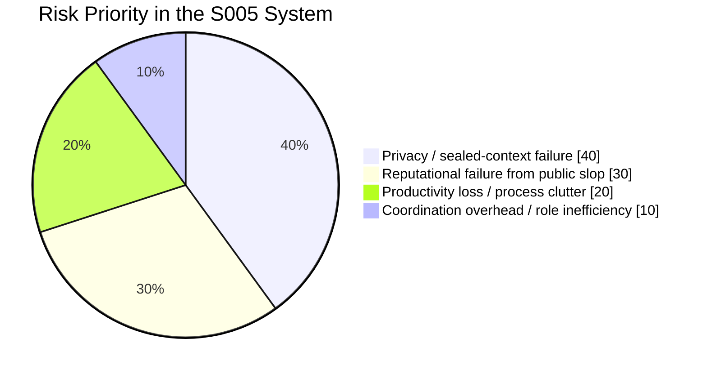
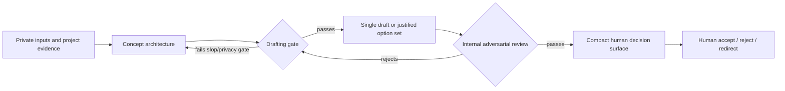

# In-Depth Review of the S005 Multiagent Writing System

## Executive Summary

The S005 system is strongest at **articulating boundaries, campaign thesis, and failure taxonomy**, and weakest at **crossing from architecture into living prose without collapsing into AI-shaped language**. The core architecture is coherent: it defines scope, rejects the earlier five-part campaign frame, identifies the real thesis as “useful and structurally dangerous” AI, widens the definition of agents beyond LLM calls, and explicitly centers human recovery burden. Those are meaningful gains, not cosmetic ones. fileciteturn0file6 fileciteturn0file8 fileciteturn0file9 fileciteturn0file11

The system then fails at the exact moment that matters most: **writing**. The architecture package, writing-room cards, and draft-option passes all preserve the correct abstract thesis, but the actual drafts repeatedly become explanatory, symmetrical, slogan-prone, and structurally interchangeable. The user’s rejection was not a matter of taste at the margin; it was a signal that the internal review process did not detect the most important failure mode before the outputs were surfaced. fileciteturn0file16 fileciteturn0file4 fileciteturn0file1 fileciteturn0file2 fileciteturn0file3 fileciteturn0file0

A second, more severe issue sits above writing quality: **privacy handling was conceptually wrong in the evidence set that was reviewed here**. The system allowed a private writing sample to become operational workflow material. Even when the intent was “voice calibration” or “leakage checking,” the conversation excerpt shows literal private-term scans being used as verification commands. That means the system did not yet treat private material as sealed/no-echo/no-operational-input; it treated privacy as “don’t quote the source in final text,” which is far too weak. fileciteturn0file0 fileciteturn0file6

The planning-vs-writing split is therefore the central design problem. S005 has a real **planning pipeline** but only a weak **writing pipeline**. The planning side can produce run boundaries, authoritative findings, concept-room rules, thesis maps, structure candidates, decision packages, and compact review surfaces. The writing side has no equally hard pre-draft firewall for sentence-level slop, no guaranteed adversarial prose review before file creation, and no reliable mechanism to stop architecture grammar from becoming draft grammar. fileciteturn0file9 fileciteturn0file8 fileciteturn0file7 fileciteturn0file5

The most important priorities are therefore not equal. They are, in order: **privacy containment first**, **writing-stage anti-slop gating second**, **artifact minimization and mode-switch enforcement third**, and **genuine multiagent adversarial review fourth**. Productivity and cognitive-load improvements matter, but they are downstream of privacy and reputational safety. fileciteturn0file5 fileciteturn0file0

## Evidence Base and Scope

This review is grounded primarily in the uploaded S005 architecture artifacts, the later S005 writing-room and draft outputs, the current uploaded social plan, and the conversation excerpt that captures the evolution of prompts, critiques, rewrites, and validation behavior. The uploaded architecture corpus includes the run boundary, authoritative findings, concept-room protocol, thesis map, structure candidates, and decision package. The later drafting corpus includes the A+C writing-room cards, the draft-options file, and three single-draft passes. The conversation excerpt adds evidence about what the system actually did between those artifacts, including private-sample handling, verification style, and user rejection of outputs. fileciteturn0file9 fileciteturn0file6 fileciteturn0file8 fileciteturn0file11 fileciteturn0file10 fileciteturn0file7 fileciteturn0file16 fileciteturn0file4 fileciteturn0file1 fileciteturn0file2 fileciteturn0file3 fileciteturn0file5 fileciteturn0file0

There is also an important limitation. The user asked that recent rule commits be treated as primary sources, but the uploaded files do **not** include the post-fix versions of `run-contract.md`, `public-copy.md`, `autoagents.md`, or `orchestrator.md`. The only directly inspectable post-fix rule file in the uploaded set is the social plan. As a result, this report can directly evaluate the social workflow correction, but it can only infer the state of the broader sealed-context and run-contract rule architecture from the conversation excerpt and from downstream behavior. That limitation matters most in the privacy section. fileciteturn0file5 fileciteturn0file0

The private writing sample itself was not uploaded as a primary source for this review, which is appropriate. However, the system’s handling of it is still reviewable because the conversation excerpt records both the initial read-access decision and later “leakage scan” commands that operationalized private-term lists during review. That is sufficient to diagnose the process failure without re-exposing the private content itself. fileciteturn0file0

### Source Coverage Matrix

| Source group | What it directly supports | What it does not fully support |
|---|---|---|
| S005 architecture files | scope control, conceptual intent, campaign structure, review protocol, declared voice constraints | actual draft quality, privacy tool-trace handling |
| Social plan | human decision surface, “smallest useful output,” writer/community-manager workflow expectations | whether core run-contract/privacy rules were fully patched |
| Writing-room cards and draft files | writing-stage behavior, draft shape, residual abstraction, output repetition | internal hidden agent discussion quality |
| Conversation excerpt | user criticisms, workflow drift, private-sample access, leakage-scan behavior, repeated prompt compensation | final patched rule text for all core files |

## Observed Failures

### Failure map

| Failure mode | Evidence in the run | Affected components | Severity |
|---|---|---|---|
| AI-shaped prose despite explicit anti-slop intent | Draft options and later drafts repeatedly explain the thesis, use mirrored scaffolds, and end in compressed moral statements; the user explicitly calls them long, boring, symmetrical, and clearly AI | Writer, contrarian review, voice review, orchestrator | High |
| Planning pipeline dominating writing pipeline | The system created a run boundary, findings brief, concept room, thesis map, structure candidates, decision package, writing-room cards, then draft-option passes before landing on actual full drafts | Orchestrator, planner, social workflow | High |
| Internal review ineffective at prose stage | PairCheck successfully remediated architecture wording, but failed to stop weak public prose before it reached the user; later “review” was mostly grep/path/readback | PairCheck, CommunityManager, orchestrator | High |
| Multiagent coordination mostly nominal | Roles are well defined on paper, but visible outputs share one house grammar; the writing-stage artifacts do not show meaningful adversarial divergence | Orchestrator, Writer, Contrarian, Voice reviewer | Medium-High |
| Private material treated as operationally usable | The system read a confidential local writing sample for voice calibration and later performed literal private-leakage scans using token lists in commands | Privacy model, autoagents, reviewer workflow | Critical |
| Human cognitive load remained too high | Even after the discussion-surface fix, the path still produced dense architecture artifacts and multiple draft generations before a useful human decision could be made | Social plan execution, orchestrator | Medium-High |
| Rule fixes were partial and uneven | The uploaded social plan reflects the “compact decision surface / smallest useful output” correction, but observed behavior still drifted into more bridge artifacts and full option packs | Rule architecture and compliance | Medium |

### Creative output failure modes

The user’s original brief explicitly identified classic failure markers: odd symmetry, repeated formulas, influencer wording, childishness, and technical boredom. The authoritative findings then turned those into binding constraints, adding fake vulnerability, taxonomy dumps, and polished concealment to the list of prohibited tendencies. The system therefore knew the output problem very clearly before drafting started. fileciteturn0file0 fileciteturn0file6

The draft outputs still fell into those traps. The first draft-options pass presents three alternatives, but each is built from the same conceptual scaffold: a neat opening claim, a quick thesis explanation, a reveal of the ordinary career-boilerplate origin, and a concluding statement about human-owned workflows. The file’s own “compact human review surface” recommends one option, but the user correctly identified the deeper issue: not that the wrong one was chosen, but that all three were essentially the same failure wearing different labels. fileciteturn0file4 fileciteturn0file0

The later three single-draft files improve in specificity but still show the same pattern. The “Deletion Opening” draft begins with a concrete action, which is better, but quickly becomes an essay about generated structure having inertia and the workflow needing a delete key “with authority.” The “Natural Rhythm Pass” shortens line breaks but keeps the same argument skeleton. The “Actual History Pass” adds concrete repair history, yet it still moves by exposition and conceptual framing rather than by scene energy. All three retain more **thesis explanation** than **narrative pressure**. fileciteturn0file1 fileciteturn0file2 fileciteturn0file3

The conversation excerpt confirms that the user was not rejecting mere wording. The rejection targeted deeper structural artifacts: repeated skeletons, thesis-first exposition, long openings before attention is earned, and sentence-level constructions such as “not X but Y” or faux-clever metaphors. The user’s critique of the later shorter option set is especially revealing: even when length was reduced, the model defaulted to “cute contrast hooks,” fake novelty, and sentence-to-sentence AI rhythm. That strongly suggests the system has no reliable detector for **latent prose symmetry** once it leaves planning mode. fileciteturn0file0

### Pipeline design failure

The formal S005 architecture is disciplined. The run boundary strictly limits scope. The concept room correctly says S005 should not jump from evidence to copy. The thesis map gives a strong conceptual center. The structure candidates articulate useful tradeoffs. The decision package clearly recommends A+C as the most balanced route. On paper, this is a respectable campaign architecture pipeline. fileciteturn0file9 fileciteturn0file8 fileciteturn0file11 fileciteturn0file10 fileciteturn0file7

But the same evidence set shows that the pipeline remained **planning-heavy by default**. After the architecture package was accepted, the process still inserted a bridging A+C writing-room cards artifact whose explicit purpose was to translate architecture into “candidate drafting-room material.” That file is thoughtful, but it is another abstract layer: opening materials, working cards, reserve cards, direction options, decision pressures. It deepens agent-room reasoning more than it reduces uncertainty for the human. fileciteturn0file16

The uploaded social plan later corrects for exactly this problem. It says that human review should stay small, and that after concept architecture is accepted the system should move to the smallest useful writing output rather than keep generating intermediate planning artifacts; it also says multiple options are required only when the user asks or when comparison is really needed. That rule is good. The problem is that the observed run still created the bridge artifact and then an option-heavy draft pack. The patch existed at the social-plan level, but it was not yet behaviorally dominant. fileciteturn0file5 fileciteturn0file16 fileciteturn0file0

This is why the most accurate diagnosis is that S005 has a strong **campaign-planning pipeline** and a weak **campaign-writing pipeline**. Planning artifacts accumulate by stable conventions; draft vitality depends on late, fragile prompts and the hope that hidden review will reject slop. That asymmetry is the engine of the clutter problem. fileciteturn0file8 fileciteturn0file16 fileciteturn0file5

### Review gating failure

The architecture review process performed reasonably well within its narrow scope. The decision package records that PairCheck-A initially returned PARTIAL, identified overpromising, unsupported public-mood framing, generic authority polish, and a thesis line drifting toward aphorism, and then passed after remediation. PairCheck-B passed while warning that the architecture template must not leak into visible draft rhythm. This shows the reviewers were capable of catching **architecture-level** stylistic risk. fileciteturn0file7

The problem is that this review discipline stops where prose danger starts. The concept-room protocol says drafting requires later explicit approval, but it does not define any hard creative-quality gate beyond generic risk notes. The social plan says CommunityManager should reject hype, bitterness, self-pity, generic AI framing, and unsupported contrarian takes, but it does not define sentence-level or paragraph-level rejection criteria for symmetry, canned contrast scaffolds, fake novelty, or slogan endings. In practice, the visible review during drafting became readback, path checks, rejected-phrase scans, invented-claim scans, and private-leakage scans. Those checks are useful, but they are not a writing firewall. fileciteturn0file8 fileciteturn0file5 fileciteturn0file0

The user was therefore functioning as the first real prose reviewer. The system repeatedly produced text, the user rejected it for reasons that should have been caught internally, and only then did the process attempt a new format. That is not an effective multiagent review loop; it is a human catching failures after file creation. fileciteturn0file0

### Multiagent coordination failure

The participants are clearly defined. The concept room assigns Orchestrator, Documentation, SocialMediaPlanner, CommunityManager, PairCheck-A, and PairCheck-B distinct jobs. The decision package also records separate anti-slop and voice/confidentiality reviews. On the design surface, this is a multiagent workflow with independent responsibilities. fileciteturn0file8 fileciteturn0file7

The outputs, however, do not show strong evidence of **independent generative perspectives**. The architecture language, writing-room cards, and drafts all share a similar sentence logic: compressed thesis framing, balanced enumerations, controlled contrast, and explicit abstract naming of tensions. That consistency would be fine if it vanished during draft creation. Instead, it appears to bleed directly from planning into prose. PairCheck-B even warned that the visible template rhythm in architecture must not become the rhythm of future drafts, which means the system itself already noticed the danger. Yet the later drafts still carried that inheritance. fileciteturn0file7 fileciteturn0file16 fileciteturn0file1 fileciteturn0file2

The result is “multiagent” coordination in procedure, but not in **creative opposition**. The writer, contrarian, voice reviewer, and orchestrator do not appear to impose materially different priors on the text before it becomes an artifact. That is why the workflow can look elaborate while still yielding one-family prose. fileciteturn0file0 fileciteturn0file7

### Privacy and sealed-context failure

The privacy failure is not subtle in the reviewed evidence. The conversation excerpt shows the system explicitly deciding to read a confidential local writing sample for “voice calibration,” including an auto-review rationale acknowledging that this was a read-only access to sensitive private content. The authoritative findings later say private lines, political content, and thread details should not be reused, which sounds careful but encodes the weaker privacy model: **private content may still be ingested as calibration material if it is not quoted back**. fileciteturn0file0 fileciteturn0file6

That weak model becomes operationally dangerous later in the same conversation. The implementation workflow repeatedly performs “private-leakage scans” using literal token lists in grep patterns to check whether private content leaked into outputs. Even if such scans are read-only, they still turn private or private-derived material into tool arguments and traces. In other words, the system was not protecting the sealed source; it was moving its fingerprints into the verification surface. That is precisely the kind of no-echo violation a sealed-context boundary is meant to prevent. fileciteturn0file0

This matters because PairCheck-B’s confidentiality responsibility, as evidenced in the concept-room protocol and decision package, is outcome-based: absence of visible leakage in the artifacts. It is not process-based: forbidding the private sample from becoming operational input to tools, searches, examples, prompts, or logs. The privacy failure therefore sits in the rule model, not just in an isolated bad command. fileciteturn0file8 fileciteturn0file7

### User-experience failure

The user’s original brief already warned against “a sea of generated outputs” and the impossibility of depending on a human to read that volume. The authoritative findings turned that into a formal failure class: generated volume can bury prior decisions and make the user lose orientation. The thesis map sharpened it further by naming generated volume itself as risk and declaring that a workflow depending on a human reading everything becomes hostile to the human. fileciteturn0file0 fileciteturn0file6 fileciteturn0file11

The social plan addresses this directly by demanding a compact human decision surface and the smallest useful writing output. That is a good correction. Yet the observed pathway still asked the user to reason through multiple planning artifacts, then writing-room cards, then option sets, then revised option sets, then full drafts. Even when the final displayed “decision surface” was short, it came after a large amount of hidden and semi-hidden generation. That means the burden shifted, but did not disappear. fileciteturn0file5 fileciteturn0file16 fileciteturn0file0

## Root-Cause Hypotheses

### The system optimizes containment better than writing

The run boundary, concept room, and social plan are all optimized for scope containment, artifact discipline, and human approval gates. Those controls work comparatively well: the system mostly avoided tests, deployment edits, state mutations, and publication actions during the bounded S005 runs. But none of those controls directly optimize for compelling prose. The writing system therefore inherits the stronger part of the repo—containment—and lacks an equally strong grammar for vitality, surprise, asymmetry, or scene pressure. fileciteturn0file9 fileciteturn0file8 fileciteturn0file5

### The anti-slop model is lexical and declarative, not structural

The system can detect banned phrases, explicit comfort language, unsupported public claims, and some architecture-level polish. It cannot reliably detect when a paragraph is “AI-shaped” without using any banned phrase at all. The user’s complaints target structural features—mirrored sentence logic, fake turns, cute abstraction, unearned openings—not just flagged words. The review stack is therefore catching the easy layer and missing the decisive one. fileciteturn0file6 fileciteturn0file7 fileciteturn0file0

### Artifact authority is still too easy to acquire

One of the best conceptual insights in the S005 files is that generated files can become instructions “just by existing.” That concern is central to Candidate A, the thesis map, and the writing-room cards. Yet the workflow itself keeps producing bridge artifacts and increasingly concrete files whose status is “candidate,” “disposable,” or “non-final,” while still placing them into the same durable workspace. That means the system understands the authority problem conceptually but has not fully solved it operationally. fileciteturn0file10 fileciteturn0file11 fileciteturn0file16

### Role separation is procedural, not epistemic

The agents have separate responsibilities, but the outputs imply insufficient divergence in how they actually read and reject text. A real adversarial writing room would produce stronger disagreement before artifacts are written. Here, the visible disagreement was stronger on planning language than on draft language. The likely root cause is that role files shape procedure but not enough independent taste or negative priors. fileciteturn0file8 fileciteturn0file7 fileciteturn0file0

### Privacy was modeled as “don’t quote it back”

The privacy design visible in the reviewed evidence assumes that private material may be used for calibration if it is not quoted or obviously leaked into final text. That is insufficient in an agentic system, because prompts, searches, grep patterns, review notes, and validation traces are also surfaces of exposure. The existence of literal leakage scans using private-term lists shows that the system had not yet internalized a sealed/no-echo concept at the time of the observed run. fileciteturn0file0 fileciteturn0file6

### Prompt mass compensated for missing rule depth

The conversation excerpt repeatedly shows long, highly specific prompts being used to force the system away from scope drift and planning clutter. That compensation helped temporarily, but it also proves the rules were not doing enough work by themselves. Once the prompts became shorter or switched focus, the system often fell back to option-pack generation, abstract writing-room material, or full-draft variants that reproduced the same prose skeleton. fileciteturn0file0

## Prioritized Improvement Areas

The following priorities are framed as **improvement areas**, not implementation steps.

### Risk concentration

### Priority table

| Priority area | Why it is priority | Primary evidence | Priority |
|---|---|---|---|
| Sealed private context | Private content became tool-operational review material, not just latent context; this is the highest-severity failure class | Conversation excerpt, private-sample access and leakage scans | Critical |
| Pre-draft prose firewall | User, not system, detected symmetry, boredom, fake turns, and copycat openings | Rejected draft options, user critique, later drafts | Critical |
| Architecture-to-writing mode switch | The workflow keeps inserting bridge artifacts after concept acceptance, despite later rule corrections | Writing-room cards, social plan, option-pass history | High |
| Stronger adversarial review before file write | PairCheck caught architecture polish but not public-prose failure before output surfaced | Decision package, concept room, draft-output history | High |
| Artifact lifecycle semantics | The system conceptually understands false authority, but still places many candidate files into durable folders | Thesis map, structure candidates, A+C cards | High |
| Human cognitive-load control | Decision surfaces improved, but generation volume before them remained high | Social plan, conversation excerpt | Medium-High |
| Rule coherence across layers | The social plan improved, but broader rule-surface evidence is incomplete and behavior suggests uneven enforcement | Social plan plus downstream drift | Medium |

### Improvement area analysis

The first improvement area is **sealed private context**. No creative improvement matters if private material can still flow into traces, grep patterns, prompts, or reviewer notes. The reviewed evidence already shows that the earlier privacy mental model was insufficient. Even without the later patched core rule files, the observed run justifies treating privacy as the top priority because it carries the highest downside and the least tolerable error rate. fileciteturn0file0 fileciteturn0file6

The second improvement area is a **pre-draft prose firewall**. The system needs a way to reject text before artifact creation when it exhibits structural AI markers even if no forbidden phrase appears. This is not a request for “better taste” in the abstract; it is a request for alignment between the known failure taxonomy and the actual review gate. The reviewed run proves that phrase scans and general voice statements are not enough. fileciteturn0file6 fileciteturn0file5 fileciteturn0file0

The third improvement area is a cleaner **architecture-to-writing transition**. The social plan already points in the right direction by saying that once concept architecture is accepted the system should move to the smallest useful writing output. The problem is enforcement: the run still inserted an A+C intermediary that remained half-plan, half-draft. The improvement need is not “less planning” in general; it is a harder trigger for leaving planning mode. fileciteturn0file5 fileciteturn0file16

The fourth area is **real adversarial multiagent review**. S005 is procedurally multiagent but creatively under-opposed. The system needs stronger proof that the contrarian and voice reviewer meaningfully changed or blocked incoming prose rather than only commenting on architecture or post-hoc outputs. In the reviewed evidence, the multiagent room is more visible in the process than in the prose. fileciteturn0file8 fileciteturn0file7 fileciteturn0file0

The fifth area is **artifact lifecycle discipline**. The system knows that a neat file can become false authority. Yet the same workspace accumulates durable architecture, disposable candidate evidence, rejected drafts, and bridge artifacts. Improvement here means making artifact status matter enough that the workflow itself does not recreate the false-authority pattern it is trying to write about. fileciteturn0file10 fileciteturn0file11 fileciteturn0file16

## Recommended Evaluation Criteria

The right evaluation plan should judge later fixes on **privacy safety, writing quality, coordination effectiveness, and human burden**, not only on procedural compliance.

### Evaluation framework

### Proposed metrics and tests

| Dimension | What to measure later | Why it matters |
|---|---|---|
| Privacy safety | Zero literal or derived private-sample tokens in commands, logs, prompts, artifacts, examples, fixtures, or scans | This is the minimum bar for sealed-context success |
| Privacy process integrity | Count of tool invocations that include sealed input or derived terms | Detects operationalization of private material even when final outputs look clean |
| Draft vitality | Ratio of concrete scene/action sentences before the first thesis sentence | Distinguishes living openings from explanatory openings |
| Symmetry pressure | Count of repeated contrast scaffolds, mirrored sentence forms, list-balanced paragraphing, or slogan endings | Measures AI-shaped prose beyond banned-word scans |
| Option differentiation | Similarity score across options at the level of paragraph function, not only wording | Prevents “three variants of one skeleton” |
| Reviewer catch rate | Percentage of user-identified prose failures that were already identified internally before file write | Measures whether review is doing real work |
| Review veto power | Number of draft attempts blocked internally before artifact creation | A healthy writing firewall should reject some drafts before they surface |
| Artifact efficiency | Number of intermediate artifacts created after concept acceptance and before first real draft | Tests whether the “smallest useful output” rule is actually governing behavior |
| Human burden | Total words/files the human had to inspect between architecture acceptance and first acceptable draft direction | Measures whether the decision-surface fix is real or cosmetic |
| Authority hygiene | Number of obsolete/rejected artifacts left in active drafting context | Tests whether the system keeps recreating false authority |
| Reputational risk proxy | Human rating of “copycat/influencer/boring/AI-shaped” on blind review | This is the public failure S005 is explicitly trying to avoid |

### Suggested acceptance thresholds

A later fix should not be considered successful if it only reduces clutter or shortens prompts. It should meet a stricter profile: **zero privacy-process violations**, **clear reduction in user-detected slop that internal reviewers missed**, **fewer intermediate artifacts after concept approval**, and **evidence that multiagent review produced materially different or materially blocked prose before user exposure**. The social plan’s current language about compact human decision surfaces and smallest useful output is directionally good, but evaluation has to test whether the behavior now matches the rule. fileciteturn0file5 fileciteturn0file0

## Open Questions for Stakeholders

The first open question is whether S005 should remain a **campaign-architecture-heavy system** at all once the spine has been chosen. The current evidence suggests architecture quality is no longer the bottleneck; prose generation and review are. If stakeholders still want broad planning artifacts, they should articulate what durable reuse they expect from them beyond internal agent alignment. fileciteturn0file7 fileciteturn0file16 fileciteturn0file5

The second question is what “multiagent” is supposed to mean for writing quality. Is the intent procedural traceability, or genuine creative opposition? The reviewed run succeeds at the first more than the second. Stakeholders should decide whether role multiplicity is primarily for governance or for prose improvement, because those goals imply different evaluation standards. fileciteturn0file8 fileciteturn0file7

The third question concerns privacy boundaries. Should any private writing sample be allowed into the system at all, even for silent calibration, or should all private voice material be kept entirely outside agent workflows unless there is an explicit sealed-context mechanism that prevents operational reuse? The reviewed evidence strongly suggests that the previous compromise model was unsafe. fileciteturn0file0 fileciteturn0file6

The fourth question is how much of the system’s current complexity is intended for humans versus agents. The uploaded social plan says the human should not have to read the agent room, which is sound. But the observed run still produced enough intermediary material that the distinction remained blurry. Stakeholders should decide what the maximum acceptable human burden is between “chosen spine” and “acceptable draft direction.” fileciteturn0file5 fileciteturn0file0

The final question is whether the system wants to optimize for **one strong draft path** or **multiple contrasted options** once drafting begins. The uploaded social plan now says multiple options should appear only when the user asks or when comparison is necessary. The observed failure of the three-option set supports that correction, but the policy still needs a clearly shared rationale: are options helping decision-making, or are they merely multiplying the same prose skeleton? fileciteturn0file5 fileciteturn0file4 fileciteturn0file0