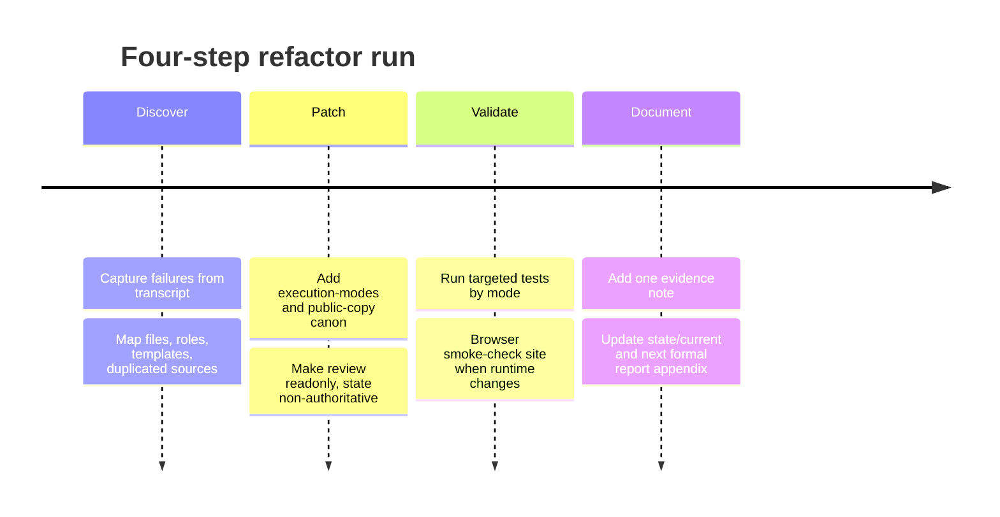

# AgenticCareerBoost Refactor Findings From Conversation Evidence

## Executive summary

The conversation shows a consistent pattern: the project’s instruction layer expanded simple requests into multi-step “system work,” and that expansion repeatedly overrode user intent. The concrete symptoms were stable across the thread: process loops instead of output, copy drift away from campaign strategy, tests firing for text-only work, manual site-source duplication, and repeated confusion between **rules**, **state/evidence**, **drafts**, and **public artifacts**. The strongest conclusion is not “one file is bad,” but that the repo lacked a small, enforced contract for execution mode, source authority, and write boundaries. fileciteturn0file0

A minimal remediation path emerged and was repeatedly reaffirmed in the conversation: keep `docs/**` authoritative, keep `state/**` as evidence/status only, add a canonical execution-mode file, add a canonical public-copy file, make review read-only by default, remove ceremony pressure from PR/tests/benchmarks, and stop tracked mirror copies between canonical repo files and site paths. Later discussion also showed that larger structure changes can help, but only after the minimal contract is correct and browser/runtime validation is part of the flow. fileciteturn0file0

> “future copy, campaign, and implementation tasks do not expand into unnecessary sprints, tests, logs, site-code edits, or stale voice rules.” fileciteturn0file0

> “state/** remains in the repo as evidence and status, but never defines future behavior.” fileciteturn0file0

> “we dont want to manually copy stuff on each update if theyre in the same repo.” fileciteturn0file0

## Failure evidence and symptoms

The user-guided failure set is coherent. First, the repo encouraged an **eternal documentation loop**: the run kept producing contracts, ledgers, closures, and validation traces even when the real task was already resolved. The transcript explicitly frames the goal as preventing work from expanding into “unnecessary sprints, tests, logs, site-code edits.” That is the clearest evidence that process was acting as a default output rather than a tool. fileciteturn0file0

Second, the system generated **over-engineered documentation with little real output**. The plan itself had to add specific cleanup for PR-template ceremony, benchmark contamination, stale report handling, and state/status drift, which implies these were already crowding out the actual task. The conversation later confirms this by calling out “ceremony pressure,” “duplicate prose,” and stale tool-output steering future work. fileciteturn0file0

Third, there was **voice drift**. The conversation repeatedly treats `content/social/style-book.md` as stale and proposes promoting June “dehype” rules into a stable `docs/core/public-copy.md`, because the existing voice sources were causing the copy to slide back into an older, less accurate posture. fileciteturn0file0

Fourth, the system showed **scope drift**: tests and site edits were triggered for text-only or copy-only requests. The proposed fix explicitly forbids CSS, JS, Python, tests, generated data, state logs, and site behavior changes in copy/text-only modes unless requested. That patch only makes sense because those unwanted actions were occurring. fileciteturn0file0

Fifth, there was **source duplication and deployment confusion**. The transcript documents divergent duplicates for status JSON, exact duplicates for diagrams/screenshots, and non-identical duplicates for CV files, followed by repeated debate over `.site-dist`, root upload, and whether the site should consume canonical originals directly. fileciteturn0file0

## Implicated files and repository surfaces

The file-level picture below distills the files most often implicated in the transcript and the behavior each one was associated with. This mapping is inferred from the conversation’s repeated edit plans, review findings, and reversions, not from a fresh repository crawl. fileciteturn0file0

| File or surface | Problem observed in conversation | Recommended action | Priority | Risk if untouched |
|---|---|---|---|---|
| `AGENTS.md` | Mixed direct-user priority with workflow expansion; stale references to logs/state as operational inputs | Patch, do not replace | High | Continues scope drift |
| `docs/workflows/sprint.md` | Treats `state/active-sprint.md` like a contract source; ceremony-heavy closure | Patch | High | Documentation loop |
| `docs/workflows/operate.md` | Escalation path turns small work into sprint work | Patch | High | Over-expansion |
| `docs/workflows/review.md` | Mutating review effectively defaulted on | Patch to read-only default | High | Unrequested edits |
| `docs/agents/orchestrator.md` | Duplicates contract logic and reads state as task source | Patch | High | Control contradiction |
| `docs/agents/paircheck.md` | Added extra review/logging ceremony | Patch | Medium | Review loops |
| `docs/agents/developer.md` | No strong negative write-scope for text-only | Patch | High | Code/site edits on copy tasks |
| `docs/core/truth-hierarchy.md` | Needed stronger “state is evidence, not authority” language | Patch | High | Poisoned next runs |
| `content/social/style-book.md` | Stale voice canon | Archive/delete as active source | High | Voice drift |
| `content/social/plan.md` | Better strategy source, but weakly canonicalized | Patch to point to public-copy canon | Medium | Split voice source |
| `.github/PULL_REQUEST_TEMPLATE.md` | Universal closure ceremony | Simplify/mode-aware | Medium | Process inflation |
| `benchmarks/tasks.json`, `benchmarks/test_agentic_system.py` | Frozen LLM behavior rewarding artifact count/structure | Quarantine and rewrite | High | Regressions into ceremony |
| `content/reports/copilot-tool-output-rojectreview.md` | Stale tool-output steering later work | Archive/quarantine | Medium | Context poisoning |
| `state/current.md`, `state/active-sprint.md`, `README.md` | Status contradictions and stale wording | Patch and sync | High | False blockers |
| `site/assets/**`, `site/assets/data/public-status.json`, `site/assets/curriculum/**` | Tracked mirror copies of canonical files | Remove tracked duplicates | High | Silent divergence |
| `content/social/drafts/**` | Discarded drafts acting as poisoning source | Keep folder for future candidates; delete stale draft bodies | Medium | Reused bad copy |
| `state/logs/**`, `state/summaries/**`, `bootstrap/**` | Evidence incorrectly treated as clutter in one failed cleanup | Preserve as evidence, non-authoritative | High | Loss of proof/history |

## Root causes and recurring anti-patterns

The recurring root cause was **control-hierarchy contradiction**. The project said user intent was highest priority, but several workflow and role files still allowed escalation, review mutation, or state-driven behavior when the user had already narrowed scope. That mismatch is the direct cause of “I asked for text, it ran tests/edited site code instead.” fileciteturn0file0

The second root cause was **missing execution-mode and negative write-scope**. The transcript repeatedly converges on the need for `answer-only`, `text-only`, `site-copy-only`, and `implementation`, with explicit prohibitions for each. Without that, “where appropriate” validation always expands. fileciteturn0file0

The third was **state/source confusion**. The thread repeatedly corrects the rule to: docs define behavior, state records evidence/status. Earlier wording and workflow contracts still treated `state/active-sprint.md` and other state artifacts as inputs for future behavior. fileciteturn0file0

The fourth was **benchmark and tool-output contamination**. The conversation itself says benchmarks and old reports were freezing undesirable behaviors and “reward[ing] ceremony over correct behavior.” fileciteturn0file0

The fifth was **manual mirroring of site data/assets**. Duplicate checked-in files made drift inevitable, and later debate over `.site-dist` versus root upload shows the repo had not yet settled a minimal, canonical source model. fileciteturn0file0

## Prioritized refactor actions and minimal patches

The most defensible order of application is small-first, structure-later. The table below reflects the conversation’s own evolution toward “less is more.” fileciteturn0file0

| Order | Action | Minimal patch | Effort | Impact |
|---|---|---|---|---|
| First | Enforce execution modes | Add `docs/core/execution-modes.md`; in `AGENTS.md`: “direct prompt selects mode; text-only forbids code/tests/state/site changes unless requested.” | S | Very high |
| Second | Canonicalize copy direction | Add `docs/core/public-copy.md`; point `content/social/plan.md` to it; remove `style-book.md` as live source | S | High |
| Third | Make review non-mutating by default | In `review.md`: readonly unless user explicitly asks for fixes | S | High |
| Fourth | Stop state from acting as authority | Patch `truth-hierarchy.md`, `sprint.md`, `orchestrator.md`, `cicd.md` to say state is context/evidence only | M | Very high |
| Fifth | Remove ceremony pressure | Simplify PR template; quarantine legacy benchmarks/tool-output | M | High |
| Sixth | Eliminate tracked mirror copies | Delete duplicated site status/CV/diagram copies; keep one canonical source | M | High |
| Seventh | Only then consider larger tree reorg | Evaluate `agents/` / `site/` / root split after runtime validation | L | Medium |

Example micro-patches that fit the conversation:

```diff
+ Direct user scope selects execution mode.
+ text-only: no tests, no CSS/JS/Python, no state/log writes, no site behavior edits.
+ state/** is evidence/status only; never acceptance criteria or future-run authority.
```

```diff
- Review may correct files as part of routine workflow.
+ Review is read-only by default.
+ Mutating review requires explicit user request.
```

## Canonical files, safeguards, and evidence-body plan

Keep the new-file set small. The conversation supports creating only two canonical files and patching existing docs around them. `docs/core/execution-modes.md` should define the four modes, allowed writes, forbidden writes, and validation-by-mode. `docs/core/public-copy.md` should define campaign invariants, voice constraints, forbidden stale framings, and an evidence-first writing rule. If `truth-hierarchy.md` can absorb source-boundary rules cleanly, do that instead of creating a third file. fileciteturn0file0

Regression protection should be equally narrow. Replace broad structural benchmarks with a few behavior tests: text-only cannot touch code/site paths or run tests; state cannot be cited as authority in docs; no tracked duplicate pairs for status/CV/diagrams; browser smoke checks run only when site/runtime files change. Legacy benchmark files should be moved out of default CI and marked as `legacy`/`archive` until rewritten around behavior, not ceremony. fileciteturn0file0

For the repo evidence body, add one concise findings note under `state/logs/` or the current evidence path, reference it once from `state/current.md`, and mention it in the next formal LaTeX report appendix instead of scattering links. Suggested commit subjects: `agentic-system: add execution modes and public-copy canon`, `agentic-system: make review readonly and state non-authoritative`, `site: remove tracked mirror copies and sync root/site paths`. fileciteturn0file0

Assumptions: this report relies on the conversation transcript and filenames mentioned there, not on a fresh repository checkout; some file states described in the transcript may have been later reverted. The recommendations therefore prioritize the stable design conclusions repeatedly reaffirmed across the thread. fileciteturn0file0

