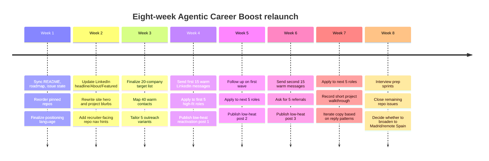
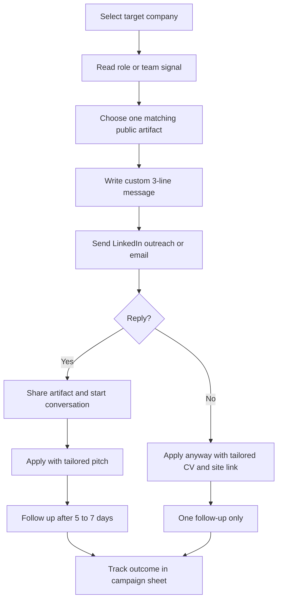

# Agentic Career Boost Audit and Barcelona Market Deep Research

## Executive summary

I verified the public identity behind this campaign as **Dídac Llorens / DidacLL / didacllorens / didacll.github.io/AgenticCareerBoost** because the repository README links to the public site and LinkedIn, the public site links back to GitHub and LinkedIn, and the GitHub profile links back to the same site and LinkedIn profile. That cross-linking is strong enough to treat these as the current public surfaces for the campaign. citeturn47view0turn20view0turn25view0turn22search0

The strategic direction should **shift away from “student / ML-data learner” framing and toward “systems-minded AI/product/tooling builder with regulated-domain judgment”**. Barcelona’s market is still growing, but it is growing in a **mid-level and senior-weighted** way. Mobile World Capital reports 36,460 digital offers in Barcelona in 2025, with demand rising for mid-level and senior talent, while El País, citing the same 2026 report, notes that junior offers fell roughly 26.9% over the last three years. That means you should not lead with “junior,” “career changer,” or “data quality” positioning. You should lead with proof of judgment, architecture, communication, workflow design, and product sense. citeturn28view0turn27news37turn39view0turn18view1turn17view0

Your public assets are already much stronger than in the earlier phase. The GitHub profile is active and coherent, the site is live and well-crafted, and LinkedIn is visibly active, with recent posts that already express a differentiated anti-hype, architecture-first voice. The problem is not absence; it is **alignment drift**. The repo README is stale, the roadmap numbering is inconsistent with the actual sprint history, one policy file still says the site is “not yet deployed,” and the remaining open issue still lists tasks that are already complete. Those inconsistencies are exactly the kind of friction that weakens recruiter trust when the whole brand promise is “inspectable systems work.” citeturn23view0turn20view0turn25view0turn47view0turn14view0turn15view1turn19view0turn26view0

On the market side, the best-fit Barcelona lanes are not pure data-cleaning or generic junior SWE. The best-fit lanes are **AI product and workflow roles, solutions engineering, product engineering, product design for complex software, developer tooling, and regulated-domain AI/fintech systems**. Barcelona’s average digital salary reached about **€51,000** in 2025, and the highest-paid specializations included **AI at about €59,500**. Product benchmarks are also attractive: Levels reports a Barcelona PM median total compensation around **€64.3k**, and Product Designer median total compensation around **€56.0k**. citeturn28view0turn27search1turn29search11

My strongest recommendation is to run the campaign in this order: **clean the repo and sync status first, tighten GitHub/LinkedIn/site copy next, then run a Barcelona target-company campaign aimed at solution-oriented product, design, and AI workflow teams, while using live openings as anchors rather than the full strategy.** In other words: fix narrative integrity first, then sell the narrative. citeturn18view0turn14view0turn26view0turn40view1

## Verification and public-source audit

### What was verified

The current repo is publicly reachable as **DidacLL/AgenticCareerBoost**. The repo contains 78 commits, 1 open issue, and 0 open pull requests at the time of the audit. The README identifies the project as a public engineering campaign and links to the public site and LinkedIn. The public site is live, branded as **Dídac Llorens**, and explicitly presents projects, CV, blog, and contact. The GitHub profile bio describes you as a UOC software engineering student focused on ML/AI, agentic systems, LaTeX, and technical tooling. LinkedIn search results identify the matching profile as **“Dídac Llorens Bravo - Software Engineering · ML/AI (UOC, 2027) · Data & Systems · Python · Java · C/C++ · Barcelona.”** A recent public LinkedIn post confirms the profile is active and uses a distinctive architecture-and-governance voice rather than generic AI enthusiasm. citeturn47view0turn20view0turn25view0turn22search0turn23view0

### What the public sources currently communicate

The site currently communicates three things very well: you are in Barcelona, you think in systems, and you care about readable artifacts and human oversight. The homepage copy about “inspectable systems” and agents being useful only when kept under human judgment is strong and highly differentiated. The projects page also does a good job of framing work as something that can be opened and explained, not just cosmetically displayed. citeturn20view0turn21view0

The current weakness is positioning hierarchy. The homepage masthead still leads with **“Software Engineering · UOC”**, and the homepage/CV repeatedly foreground **ML/Data** and student status before foregrounding the stronger commercial signal: **systems judgment, workflow design, documentation depth, and product-minded engineering**. That makes the public story slightly “early-stage” even though the tone and the repo structure are already more mature than that. The GitHub profile has the same tendency: good themes, but the first-line positioning is still education-first rather than capability-first. citeturn20view0turn21view1turn25view0turn40view3

LinkedIn is the most promising surface. The public snippet shows a headline that is broad but still fairly commodity-like because it lists fields and languages. The recent post, by contrast, is much stronger: it argues that LLMs do not make architectural decisions, that engineers must interrupt fashionable defaults, and that AI-assisted engineering needs more architecture, not less. That voice is exactly the right material to convert into your canonical headline/About posture. citeturn22search0turn23view0turn40view1

### Recommended copy direction

The repo’s own brand and marketing docs already tell you what the public copy should become: technical, disciplined, direct, slightly artistic, not generic AI hype, not “just another junior,” and always evidence-led. The LinkedIn research in the repo also explicitly recommends a forward-looking headline and a bridge-story About section rather than “student” or “career changer” framing. citeturn17view0turn18view0turn40view3turn40view4

#### LinkedIn headline variants

1. **Systems-Minded Software Engineer | AI Workflows, Product Thinking, and Inspectable Tooling**  
2. **Software Engineer Building AI Workflow Systems, Product Tools, and Recruiter-Readable Proof**  
3. **Engineer for AI Workflows and Product Systems | Barcelona | Regulated-Domain Judgment**  
4. **Product-Minded Software Engineer | Agentic Workflows, Tooling, and Complex Systems**  
5. **Software Engineer | AI Orchestration, Technical Tooling, and Systems That Can Be Inspected**

These are better than the current public headline because they foreground capability, judgment, and differentiation before status or language lists, which matches both the repo guidance and the current tone of your public posting. citeturn17view0turn40view3turn23view0

#### Short About variants

1. **I build software systems that can be opened, explained, and trusted. My current work sits at the intersection of AI workflows, product thinking, and technical tooling, shaped by years of experience in regulated operations.**  
2. **I’m a Barcelona-based software engineer focused on AI workflow design, product systems, and technical tooling. I care less about hype and more about judgment, traceability, and systems that survive inspection.**  
3. **My work is about turning technical capability into visible proof: repositories, documentation, product flows, and tools that show decisions instead of hiding them.**  
4. **I build inspectable software artifacts: AI workflow systems, product-facing tools, and technical documentation that make reasoning visible. My edge is combining engineering with regulated-domain discipline.**  
5. **I’m moving toward AI and product-system work through a public portfolio built around architecture, documentation, and workflow design. I use agents, but I keep the final shape under human judgment.**

All five keep the bridge-story structure the repo recommends: where you are going, what unusual strength you bring, and what visible proof you are building now. citeturn40view3turn40view4turn18view1

#### Website hero rewrite

**Current public direction:** “Software Engineering · UOC” with a profile section that emphasizes ML/data learning, backend base, and banking/insurance operations. citeturn20view0turn21view1

**Recommended hero copy:**

**Headline:**  
**Software engineer building AI workflows, product systems, and technical tooling**

**Subhead:**  
**Barcelona-based. I turn architecture, documentation, and iteration into visible proof—especially where reliability, user trust, and human oversight matter.**

**Support line:**  
**Background in regulated operations. Current focus on AI workflow design, product-minded engineering, and recruiter-readable public artifacts.**

This keeps the best parts of the existing voice while raising the abstraction level from “student learning ML/data” to “builder with judgment.” That is a much better fit for the 2026 Barcelona market. citeturn20view0turn28view0turn27news37

#### Portfolio entry rewrites

**AgenticCareerBoost**  
Current framing is good but still somewhat repo-internal. Rewrite it as:  
**A public operating system for career-facing engineering work: plans, reviews, reports, and a recruiter-facing site built so the work can be followed instead of guessed. Useful as both a technical system and a proof-of-judgment artifact.** citeturn21view0turn21view1turn47view0

**P3CTeX**  
Rewrite it as:  
**A document-tooling system for building repeatable technical artifacts—CVs, reports, diagrams, and structured engineering documentation—without treating documents as disposable exports.** citeturn21view0turn25view0

**IronBank**  
Rewrite it as:  
**A Java/Spring banking simulation that still demonstrates the bridge between regulated-domain operations and software systems: APIs, structure, and backend reasoning shaped by real financial-process context.** citeturn21view0turn21view1turn25view0

### Public-surface fixes before launch

Before the campaign starts, manually verify four points across all public surfaces: the same role language should appear on GitHub, the site, and LinkedIn; the Featured/links section should pin the repo and one proof artifact; the GitHub pinned repo order should put AgenticCareerBoost first; and the site hero should no longer lead with UOC/student identity. The repo itself already says profile consistency across headline/About/Featured/GitHub/site is a publication gate. citeturn26view0turn40view1turn25view0

## Repository audit and patch plan

### Core audit findings

The repo is structurally impressive, but the public-facing “single source of truth” promise is currently weakened by a few avoidable inconsistencies.

The most visible issue is the root README. It still says the **current workflow is S-002R restart implementation** and the **next sprint seed is profile consistency / site rebuild / LinkedIn drafts**, even though `state/current.md` says the active workflow is **S-003 website OS clarity**, that S-003 is closed locally as of **2026-06-26**, and that branch protection, the site rebuild, and the GitHub profile README merge are already done. citeturn47view0turn14view0turn15view0

The second issue is a genuine roadmap inconsistency. `state/roadmap.md` still labels **S-003** as the **formal case study of this system**, while `state/current.md` and `state/active-sprint.md` use **S-003** as the **website OS clarity** sprint. That is a numbering collision and should be fixed immediately because it creates uncertainty about chronology. citeturn15view1turn14view0turn15view0

The third issue is policy drift. `docs/link-guidelines.md` still lists `didacll.github.io/AgenticCareerBoost` under known CI issues because the site was “not yet deployed,” but the site is now live and the current state file explicitly says so. citeturn19view0turn14view0turn20view0

The fourth issue is backlog/issue drift. Open Issue #15 still treats the GitHub profile README decision, the professional email decision, and branch protection confirmation as unresolved human actions, even though the current state file says the profile README PR is merged, the public email decision is resolved, and branch protection is applied. citeturn26view0turn14view0

The fifth issue is presentational clutter. The repo’s language mix is still dominated by **TeX at 51.1%**, with HTML at 26%, CSS at 10.4%, Python at 4.4%, and JavaScript at 3.9%. That is not inherently wrong, but it weakens the outward signal if you want this repository to read as a software systems / product engineering asset rather than mostly a documentation repo. GitHub Linguist can be adjusted to better reflect the public intent without changing any core content. citeturn47view0turn41view0

### Specific patch list

#### High-priority docs sync

**File:** `README.md`  
**Why:** Public-facing status is stale and conflicts with `state/current.md`. citeturn47view0turn14view0

```diff
@@ Status
- Current workflow S-002R restart implementation
- Next sprint seed Profile consistency, site rebuild foundation, and LinkedIn reactivation drafts
- Latest case study Sprint S-001 PDF
+ Current workflow S-003 website OS clarity closed locally on 2026-06-26
+ Current focus Profile consistency across GitHub, site, and LinkedIn plus campaign activation
+ Latest implementation evidence state/logs/S-003-website-os-clarity/closure.md
+ Latest case study Sprint S-001 PDF

@@ Mission In One Line
- Rebuild a public technical profile through visible, agentic engineering work and make that work readable by both humans and models.
+ Build a public technical profile through visible AI workflow, product, and tooling work, and make that work readable by both humans and models.
```

**File:** `state/roadmap.md`  
**Why:** Sprint numbering collision with the live state. citeturn15view1turn14view0

```diff
@@
- S-003 Formal case study of this system LaTeX engineering report documenting the agentic OS as a case study
- S-004 LinkedIn campaign kickoff First wave of platform-adapted posts, campaign cadence established
- S-005 Portfolio gap closure Build ML pipeline project + Python showcase; close T-006, T-007 gaps from S-001 positioning
+ S-003 Website OS clarity CLOSED — simplified public route map, project voice rewrite, Blog scaffold, role paths, metadata/headless surfaces, validation evidence
+ S-004 Formal case study of this system LaTeX engineering report documenting the agentic OS as a case study
+ S-005 LinkedIn campaign kickoff First wave of platform-adapted posts, campaign cadence established
+ S-006 Portfolio gap closure Build AI/product/tooling showcase and close remaining visibility gaps
```

**File:** `docs/link-guidelines.md`  
**Why:** Deployed-site rule is outdated. citeturn19view0turn14view0

```diff
@@ Domains with Known CI Issues
- didacll.github.io/AgenticCareerBoost Site not yet deployed
+ didacll.github.io/AgenticCareerBoost Public site is live; keep checks advisory/non-blocking because static-site fetches may still fail intermittently in CI
```

**File:** `issues/15`  
**Why:** Issue scope is stale. citeturn26view0turn14view0

**Edit Issue #15 body to mark complete**
- GitHub profile README PR review → done
- Professional email decision → done
- Branch protection confirmation → done

**Keep as remaining**
- GitHub bio refinement
- pinned repo order
- LinkedIn headline/About/Featured manual check
- approval of first three reactivation posts

Then either close #15 and open a cleaner issue such as:

**New issue title:**  
`Finalize public-profile consistency gate before campaign start`

#### Medium-priority signaling cleanup

**File:** `.gitattributes`  
**Why:** Current language breakdown overstates TeX relative to the repo’s market-facing value. citeturn47view0turn41view0

```diff
@@
 *.json text eol=lf
+content/reports/** linguist-documentation=true
+state/logs/** linguist-documentation=true
+bootstrap/** linguist-vendored=true
+assets/generatedImages/** linguist-generated=true
+*.pdf binary linguist-generated=true
```

This will not change the repo content; it will improve how GitHub classifies it publicly.

**File:** `README.md` or new `archive/README.md`  
**Why:** Root-level clutter is understandable to agents but a bit noisy for recruiters. The repo already calls `bootstrap/` a historical archive; formalize that into the navigation. citeturn47view0

Recommended text:

- Add a short “What to ignore if you are a recruiter” subsection
- Explicitly label `bootstrap/`, older report folders, and `state/logs/` as archival evidence rather than first-entry reading
- Point recruiters to: `README.md`, public site, CV, `AGENTS.md` summary, one case study

#### Lower-priority content cleanup

**File:** `content/social/research/README.md`  
**Why:** Research files exist, but there is no obvious “current vs archival” framing. citeturn35view1

Suggested edit:
- label `2026-04-*` files as historical positioning research
- label `2026-06-linkedin-reactivation.md` as the most recent campaign-adjacent research package
- add a “superseded by later state files where conflicting” note

### Prioritized cleanup plan

| Priority | Work item | Effort | Why it matters |
|---|---|---:|---|
| P1 | Sync README status, issue #15, and roadmap numbering | Low | Fixes trust-breaking contradictions immediately |
| P1 | Reorder GitHub pinned repos to `AgenticCareerBoost`, `P3CTeX`, `IronBank` | Low | Makes profile match the campaign story |
| P1 | Update LinkedIn/site/GitHub first-line positioning | Low | Aligns public surfaces with current market |
| P2 | Add Linguist overrides in `.gitattributes` | Low | Improves repo signal for recruiters |
| P2 | Add recruiter-facing navigation hints and archive labels | Medium | Reduces clutter without deleting evidence |
| P3 | Move historical bootstrap/generated material under an `archive/` path | High | Cleaner repo, but risky because internal references may break |
| P3 | Record a 2–3 minute walkthrough of AgenticCareerBoost | Medium | Matches a recruiter green flag already documented in repo research |

The cleanup ordering follows the repo’s own evidence-first logic: fix contradictions first, then improve signal, then restructure archives. citeturn39view0turn18view0

### Concrete git commands

```bash
git fetch --all --prune
git checkout -b chore/public-surface-sync

git grep -n "S-002R restart implementation"
git grep -n "site not yet deployed"
git grep -n "S-003 Formal case study"

# edit README.md, state/roadmap.md, docs/link-guidelines.md

git add README.md state/roadmap.md docs/link-guidelines.md
git commit -m "docs: sync README, roadmap, and link policy with S-003 closure"

git checkout -b chore/profile-signal-cleanup
# edit .gitattributes and recruiter-facing navigation docs
git add .gitattributes README.md content/social/README.md
git commit -m "chore: improve repo signaling and archive guidance"

# optional archive pass
git checkout -b chore/archive-historical-material
git grep -n "bootstrap/" .
git mv bootstrap archive/bootstrap
git commit -m "refactor: move bootstrap prompts into archive path"
```

### Suggested PR template

```md
## Why
This PR resolves public-source drift between README, state files, and campaign surfaces.

## What changed
- synced README status with current state
- fixed roadmap sprint numbering
- updated stale deployment/link policy
- reduced recruiter-facing clutter / improved repo signaling

## Evidence reviewed
- [ ] state/current.md
- [ ] state/active-sprint.md
- [ ] state/roadmap.md
- [ ] docs/link-guidelines.md
- [ ] public site
- [ ] GitHub profile / pinned repos

## Risk check
- [ ] no internal relative links broken
- [ ] docs lint passes
- [ ] recruiter entry path still works from README
```

## Barcelona market direction

Barcelona remains one of Europe’s stronger digital talent hubs. Mobile World Capital’s **Digital Talent Overview 2026** says Barcelona reached **135,890 digital professionals** in 2025, added **6,282** digital professionals that year, and published **36,460 digital job offers**, up **4.15%** year over year. At the same time, the report is explicit that the market is not reducing need for talent but is increasingly looking for **experience**. citeturn28view0

That matters because the entry-level funnel has become harder. El País, using the same 2026 market report, says junior tech offers in Barcelona have fallen by about **26.9% in three years**, while demand has shifted toward more specialized and advanced profiles. This is exactly why your campaign should not bias toward “junior developer / data analyst” positioning. citeturn27news37

Barcelona’s compensation base is still attractive enough to justify a focused local campaign. Mobile World Capital reports an average digital salary in Barcelona of **€51,000** in 2025, with top-paid domains including **AI (€59,500)** and **cloud (€59,000)**. For product lanes, Levels reports Barcelona Product Manager compensation around **€50.5k–€81.7k** from the 25th to 75th percentile, with a median of about **€64.3k**. Product Designer compensation is roughly **€45.5k–€70.3k** from the 25th to 75th percentile, with a median around **€56.0k**. citeturn28view0turn27search1turn29search11

The ecosystem backdrop is also supportive. Mobile World Capital’s **Tech Hubs Overview 2025** says the region hosts **160 active tech hubs**, with **€2.88 billion** in economic impact and **6,191** new jobs in 2024, while ACCIÓ’s 2026 ecosystem analysis and Dealroom’s 2026 Spain report show Barcelona/Catalonia continuing to attract startup activity and AI-heavy formation. citeturn32search0turn32search1turn32search6turn32search10

### Best-fit lanes for you

Based on the market, your public proof, and your stated dislike of repetitive data-quality work, the best-fit search lanes are:

- **AI workflow / agentic systems roles** where governance, orchestration, RAG, and human oversight matter  
- **Solutions Engineering / Product Engineering** roles that combine technical depth with customer or product reasoning  
- **Product Design / UX for complex products** where documentation, systems thinking, and structure matter  
- **Fintech / insurance / regulated-domain product and AI teams** where your prior domain experience is a differentiator  
- **Developer tooling / design systems / internal platforms** where “inspectable systems” and workflow discipline are assets  

That fit is consistent with your own brand documents, which explicitly reject generic AI hype and “just another junior” framing, and with the Barcelona market’s shift toward experience-heavy hiring. citeturn17view0turn18view1turn28view0turn27news37

### What to deprioritize or avoid

The current repo evidence gives you an **avoid-signals framework** rather than a hard company blacklist. The clearest warnings are: avoid junior framing, avoid buzzword-heavy positions without real evidence/work, avoid tutorial-clone style portfolio signaling, and avoid roles that are generic generalist funnels rather than proof-of-judgment roles. The earlier Barcelona hiring research also warns that youth-coded or “Silicon Valley playroom” culture can be structurally hostile to career changers, and that the market is bifurcating against generic junior roles. citeturn39view0turn38view3

In practical terms, this means you should generally deprioritize:
- **pure data-cleaning / repetitive analyst roles**  
- **generic body-shop consulting roles with vague ownership**  
- **roles written like skills laundry lists with no product or problem scope**  
- **senior-only environments where you have no portfolio-adjacent bridge**  
- **teams with public labor/legal controversy unless the role/team quality is unusually strong**  

One company-specific caution surfaced clearly in public sources: **Glovo** remains a strong product/design school, but it also carries meaningful labor-model controversy and legal noise. That does not make it untouchable, but it means Glovo should be approached selectively rather than automatically. Another repo-based caution is **King**, which earlier research flagged as primarily senior-heavy and therefore a poor near-term fit. citeturn45news40turn45news44turn38view2

## Target companies and live openings

### Target companies in Barcelona

| Company | Why it fits you | Roles to target | Apply proactively | Hiring signal | Main caution |
|---|---|---|---|---|---|
| **CaixaBank Tech** | Best direct overlap with your banking/insurance background plus visible AI push in 2026. | AI solutions, product-adjacent platform, data/AI systems, internal workflow tooling | **Yes** | Official Barcelona careers list AI/Data roles; CaixaBank launched an in-app AI agent in Feb 2026. citeturn46search1turn46search5turn38view0 | Bank-grade process and slower cycles; use domain fit as your wedge. |
| **Factorial** | Strong fit for systems thinking, end-to-end ownership, and solution/product-adjacent work. | Solutions Engineer, Product Engineer, platform/product roles | **Yes** | Careers page is active; live Barcelona Solutions Engineer and Product Engineer roles surfaced. citeturn45search1turn31search11turn45search13 | Fast-growth environment; validate manager quality and scope. |
| **Typeform** | High fit for product systems, workflow thinking, clean communication, and anti-hype software culture. | PM Growth, PM Integrations, PM Analytics, product tooling | **Yes** | Multiple live product roles across Spain remote/Barcelona org. citeturn44search0turn44search8turn44search12turn44search4 | PM roles are senior; needs very crisp proof-of-product narrative. |
| **Perk** | Excellent fit because the company’s current AI/product story is about eliminating repetitive hidden work, which aligns with your preferences. | Product design, workflow/product systems, data-product partner | **Yes** | Barcelona design openings and active careers page; company expanded with AI-led platform repositioning. citeturn43search0turn43search4turn43news38 | Seniority bar is high; use workflow and systems case studies. |
| **Wallapop** | Strong local product/design brand; good fit if you want marketplace product craft with strategy. | Senior Product Designer, content/design systems, product strategy-adjacent roles | **Yes** | Greenhouse shows current Barcelona product/design openings. citeturn44search9turn44search1turn44search21 | Marketplace pace and high bar; don’t apply with “student” framing. |
| **The Knot Worldwide** | Good fit for product design with system complexity and visible multi-market product responsibility. | Principal/Lead Product Design, design systems, UX strategy | **Yes** | Official job board shows Barcelona principal design roles. citeturn43search2turn43search6turn43search10 | Strongly senior; only target with sharp portfolio narrative. |
| **N26** | Excellent blend of fintech, consumer product, and regulated-domain credibility. | Product Designer, product systems, customer experience tooling | **Yes** | N26 careers page is active; LinkedIn surfaced a Barcelona Product Designer role. citeturn45search2turn45search6turn45search10 | Competitive fintech brand; tailor heavily to trust, clarity, and flows. |
| **Sanofi** | Good fit if you want serious product/UX work in a structured, higher-trust environment. | Product Designer, UX for consumer or internal digital products | **Yes** | Live Barcelona Product Designer posting on official Sanofi careers. citeturn46search2 | Enterprise pace; show rigor and cross-functional maturity. |
| **seQura** | Strong local fintech target that fits domain overlap and product-minded thinking. | Senior Product Manager, payments/product systems | **Yes** | Current Barcelona PM roles on official/near-official hiring surfaces. citeturn44search3turn44search19 | PM roles are strategic; you need strong product language, not only engineering language. |
| **Zurich Insurance** | Regulated-domain advantage is very strong here, especially for AI/workflow modernization teams. | AI & Data Scientist, internal AI tooling, automation, audit-tech | **Yes** | Zurich shows Barcelona AI/Data positions and a sizable local job footprint. citeturn43search7turn43search11 | Some roles may skew toward audit/data; screen for creative-system ownership. |
| **BSC-CNS** | Ideal mission fit for your agentic / workflow / AI systems interests, especially if you want serious technical credibility. | AI workflow, RAG/orchestration, research software engineering | **Yes** | Repo research previously captured agentic AI openings; Barcelona AI factory project strengthens long-term relevance. citeturn38view2turn46news42 | Research-center cadence and application process are different from startup hiring. |
| **Red Points** | Brand protection product with AI and regulated-adjacent trust themes; strong fit for structured system builders. | Product marketing, AI/product, workflows, customer-facing technical roles | **Yes** | Official jobs page is active and the company publicly positions itself as AI-enabled SaaS brand protection. citeturn44search2turn44search10turn44search22 | Validate role seniority and salary bands case by case. |
| **Dynatrace Barcelona** | Good fit if you want design/tooling/platform credibility rather than consumer-app positioning. | Product UX, design systems, solution engineering, platform product | **Yes** | Barcelona office page is active and design-system/product UX roles surface in current listings. citeturn45search3turn45search7turn45search15 | More platform/enterprise than lifestyle-product; tailor accordingly. |
| **Amenitiz** | Good fit for strategic product/marketing and hospitality SaaS with visible growth stage. | Senior Product Manager, Product Marketing, growth/product systems | **Yes** | Official careers page is active and senior product/product marketing roles have been live recently. citeturn43search1turn43search5turn43search9 | May lean commercial/growth; screen out roles that feel too revenue-ops-heavy. |
| **Mango Tech** | Interesting because Mango is actively hiring for agentic AI and conversational AI; strong if you want applied AI in a visible product context. | Agentic AI, conversational AI, product/AI systems | **Selective yes** | Public job snippets show active agentic AI roles around Barcelona area. citeturn46search3turn46search7turn46search11 | Avoid pricing/data-cleaning lanes; stay on AI/product lines only. |
| **Glovo** | Strong product school with meaningful design scale and leadership opportunities. | Product design, UX, internal tools, marketplace systems | **Selective yes** | Active Barcelona design hiring. citeturn45search4turn45search8turn31search1 | Serious labor/legal controversy; only pursue if team, role, and compensation are compelling. citeturn45news40turn45news44 |
| **HP Barcelona** | Good for applied AI and productized systems in a stable environment. | AI engineer, software systems, R&D product tooling | **Selective yes** | Prior repo research captured active junior/graduate AI and software systems hiring in Sant Cugat. citeturn38view2turn30search7 | More engineering/R&D than product strategy; pitch accordingly. |
| **Cisco** | Strong fit for solution engineering if you want technical-commercial roles with solid career leverage. | Solutions Engineer, technical solution architecture | **Yes** | Barcelona Solutions Engineer role recently surfaced publicly. citeturn31search15 | Customer-facing and sales-adjacent; only pursue if that mix appeals. |
| **Allianz** | Good fit for AI solutions in an insurance context with enterprise-grade credibility. | AI Solutions Engineer, applied AI modernization | **Selective yes** | Barcelona AI Solutions Engineer role surfaced recently through Allianz careers. citeturn30search1 | Some roles may close quickly; prioritize if you see a direct fit. |
| **BCG X** | High-upside target if you want applied AI/product systems work with strong signal value. | Forward Deployed AI Engineer, AI workflow consulting/build teams | **Selective yes** | Barcelona AI-forward roles surfaced in current job results. citeturn31search10 | Selective and competitive; needs exceptional case-study packaging. |

### Current job postings that are worth attention

The list below mixes pure product/design roles with adjacent solution/product-engineering and AI-workflow roles because that is where your profile has the strongest asymmetry. Where salary was not listed in the posting snippet, I included the closest Barcelona market benchmark instead. citeturn27search1turn29search11turn29search4turn28view0

| Posting | Summary | Salary | Tailored pitch angle |
|---|---|---:|---|
| **Solutions Engineer — Factorial** citeturn31search11 | Barcelona; product-facing technical bridge between product and customer needs. | **€58k–€65k listed** | Pitch your ability to translate messy business processes into workable systems, plus your public evidence of architecture/doc discipline. |
| **Senior Product Engineer — Factorial IT** citeturn45search13 | Hybrid product/engineering ownership in Barcelona. | **€60.5k–€85.8k listed** | Pitch “product-minded engineer” rather than “backend/dev”; highlight systems, iteration, and public proof. |
| **Technical Solution IA — CaixaBank Tech Barcelona** citeturn46search9turn46search1 | AI solution role in a financial context. | Not listed; fintech/AI benchmark likely above city digital average. citeturn28view0 | Lead with banking/insurance context plus agentic workflow reasoning and trust/governance language. |
| **Product Designer — Sanofi** citeturn46search2 | Consumer Experience Product Designer in Barcelona. | Not listed; BCN Product Designer benchmark about **€45.5k–€70.3k**, with senior-heavy roles often higher. citeturn29search11turn29search4 | Sell design through systems clarity, user trust, and cross-functional structure, not aesthetic-only language. |
| **Senior Product Designer — Wallapop** citeturn44search1turn44search9 | Discovery-journey design with strategic and hands-on ownership. | Not listed; BCN Senior Product Designer benchmark about **€60.8k–€87.1k**. citeturn29search4 | Show how you think in flows, frameworks, and information architecture, not just screens. |
| **Senior Product Designer — Glovo** citeturn31search1turn45search8 | Large-scale marketplace UX and visual-language work. | Not listed; BCN Senior Product Designer benchmark about **€60.8k–€87.1k**. citeturn29search4 | Use this only if you can show product reasoning under complexity plus your appetite for pace and ambiguity. |
| **Senior Product Manager — Growth — Typeform** citeturn44search4turn44search12 | Product usage and growth ownership. | Not listed; BCN PM benchmark about **€50.5k–€81.7k**, median **€64.3k**. citeturn27search1 | Frame yourself as someone who understands systems, conversion friction, and human-readable product proof. |
| **Senior Product Manager — Integrations — Typeform** citeturn44search20turn44search12 | Integrations as a product surface. | Not listed; BCN PM benchmark about **€50.5k–€81.7k**. citeturn27search1 | Strongest angle: model-agnostic thinking, interoperability, and “workflow over hype.” |
| **Product Designer — N26** citeturn45search6turn45search10 | Barcelona hybrid design role in mobile banking. | Not listed; BCN Product Designer benchmark about **€45.5k–€70.3k**. citeturn29search11 | Lead with regulated-domain trust, clarity in flows, and the ability to make complex systems legible. |
| **Principal Product Designer — The Knot Worldwide** citeturn43search2turn43search10 | Barcelona principal design role with zone-level ownership. | Not listed; likely above BCN senior benchmark. citeturn29search4 | Only pursue if you can present strong strategic-product thinking and design leadership without pretending formal seniority you do not yet own. |
| **Staff Product Designer — Travel — Perk** citeturn43search4turn43search0 | Staff-level product design for a Barcelona AI-enabled scaleup. | Not listed; likely above BCN senior benchmark. citeturn29search4 | Pitch workflow simplification, hidden-work elimination, and structured product communication; this company story matches your preferences unusually well. |
| **Senior Product Manager — Payments — seQura** citeturn44search19turn44search3 | Strategic payments-platform ownership in Barcelona. | Not listed; BCN PM benchmark about **€50.5k–€81.7k**. citeturn27search1 | Lead with financial-process understanding, systems trust, and strong internal communication/documentation. |
| **AI & Data Scientist — Internal Audit — Zurich** citeturn43search11turn43search7 | AI/data role inside audit and insurance systems. | Not listed; BCN AI specialization average about **€59.5k**; senior ML benchmarks can range higher. citeturn28view0turn29search6 | Only pursue if the work is genuinely automation/AI workflow oriented, not mostly reporting or manual data cleanup. |
| **AGENTIC AI TECH LEAD — Mango** citeturn46search3turn46search7 | Agentic AI role in Catalonia with current hiring signal. | Not listed; verify level and package in process. | Good stretch role if you want explicit agentic branding in industry; use only if you can package orchestration/governance credibly. |
| **Senior Product Marketing Manager — Amenitiz** citeturn43search5turn43search13 | Barcelona-based strategic IC role owning product-led growth language and numbers. | Not listed | Strong if you want a creative/strategic lane rather than a pure IC builder lane; pitch systems clarity plus narrative rigor. |

### Outreach approach that will work best

For these companies, cold application alone is not enough. The right stack is: **light research → one strongly matched artifact → one warm outreach attempt → tailored application → one follow-up tied to a concrete product/team observation**. That is especially true for Typeform, Perk, N26, Wallapop, and seQura, where the public bar is high and generic applications are easy to ignore. The repo’s own marketing strategy already says the repository should be the canonical evidence source and public communication should adapt per channel rather than clone identical text everywhere. citeturn18view0

## Outreach templates and campaign timeline

### LinkedIn outreach template

**Template for recruiters or hiring managers**

> Hi [Name] — I’m reaching out because your team’s work at [Company] sits very close to the kind of problems I’ve been building around: AI workflows, product systems, and technical tooling that can actually be inspected and explained.  
>   
> I’m based in Barcelona and I’ve been rebuilding my public profile around visible proof rather than buzzwords: a public repo, live site, and project pages that show how I think about architecture, documentation, and human oversight.  
>   
> The role that caught my attention was [Role], especially the part around [specific problem from posting]. I think my strongest angle is the combination of software work with years of regulated-domain judgment from banking/insurance operations.  
>   
> If helpful, I can send the most relevant project page or a 3-bullet summary of why I think I fit this team specifically.

### Email template

**Subject:** Barcelona candidate for [Role] — product systems, AI workflows, regulated-domain judgment

> Hi [Name],  
>   
> I’m writing because [Company / team / role] looks unusually close to the work I’ve been shaping publicly over the last months: AI workflows, product-minded engineering, and technical systems built to be readable by both humans and machines.  
>   
> I’m currently based in Barcelona. What I think is unusually relevant for your team is not just my engineering direction, but the combination of that with 15 years in banking and insurance operations — the kind of background that makes reliability, traceability, user trust, and process design feel natural rather than theoretical.  
>   
> I’ve attached / linked the most relevant public artifact for this role: [repo/site/project page].  
>   
> If it helps, I’d be glad to share a short note on how I’d position myself for [Company’s product/problem] specifically.  
>   
> Best,  
> Dídac

### Referral strategy

The highest-yield referral strategy for your profile is not “Can you refer me?” as a first move. It is:

1. connect with Barcelona-based people in product, design, solutions, or platform teams  
2. reference one specific artifact or technical opinion you published  
3. ask a scoped question about team/problem shape  
4. only after a reply, ask whether a direct application or internal referral makes more sense

That sequence works especially well because your public materials already give people something to react to. citeturn23view0turn20view0turn25view0

### Campaign timeline



### Outreach process



### KPIs for the eight weeks

Use a small scorecard, not vague “more visibility.” The most useful KPIs are:

| KPI | Target |
|---|---:|
| Repo contradictions fixed | 100% of high-priority drift items |
| Public-surface sync | GitHub, site, LinkedIn aligned by end of Week 2 |
| Warm outreach messages sent | 30 |
| Tailored applications sent | 15 |
| Referral asks made after conversation | 5–8 |
| Positive response rate | 15%+ |
| Recruiter / hiring-manager conversations | 6–10 |
| Interview loops started | 3–5 |
| Public proof additions | 1 walkthrough + 3 low-heat posts |

The most important KPI is not applications volume. It is whether your campaign pulls you into the **experienced, systems-minded** bucket instead of the **junior generalist** bucket that the market is squeezing hardest. citeturn28view0turn27news37turn39view0