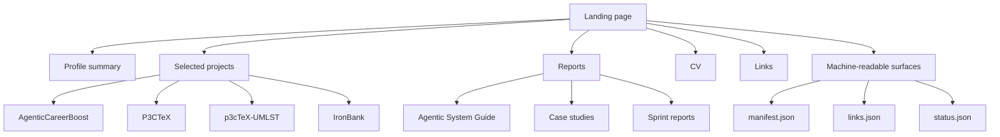

# AgenticCareerBoost Public Surface Audit

## Executive summary

AgenticCareerBoost already has a strong conceptual spine. The repository root clearly states the intended model: the repository is the operating system, reports are the formal proofs, and the GitHub Pages site is the public mirror. It also declares a canonical split between `docs/`, `state/`, `content/`, `site/`, and `data/`, and explicitly says the project should be readable by both humans and models. That positioning is coherent and unusually strong for a public technical-profile project. citeturn17view0turn17view2turn27view1

The main weakness is not lack of concept. It is surface translation. The repo says the site and downloadable CV are the fastest recruiter-facing surfaces, but the currently inspectable public artifact still uses internal-system nouns such as “role files,” “workflow files,” “project state,” and “generated reports.” Those terms make sense inside the repository model, but they are too close to internal operating language for a public-facing hiring surface. The result is a public artifact that shows originality and structure, but still leaks internal mechanics instead of cleanly translating them into externally meaningful value. citeturn17view1turn17view2 fileciteturn0file0

A second issue is crawlability and parity verification. I could open the repository root, but direct live-site fetches and deeper repo/page fetches failed in the browsing tool with cache-miss errors, including the public GitHub Pages root and direct blob/tree paths. That means I could not complete the requested full live crawl of all HTML, page metadata, images, links, and repository subfiles from the browser layer alone. In practical terms, this is already a signal: the public surface is not easy to audit externally through common automated paths, which weakens discoverability and independent verification. citeturn0view0turn16view0turn15view0turn15view2

The remediation path is clear. Keep the repository-first architecture. Tighten the public translation layer. Publish a crawlable, indexable site with explicit page summaries, structured metadata, machine-readable manifests, canonical public URLs, and release-grade artifact versioning. Remove internal-strategy leakage from public copy. Add parity checks between `site/`, `content/`, `data/`, and the deployed Pages output. The repo itself already hints this is the right direction: its current status names “Profile consistency” and “site rebuild foundation” as the next sprint seed. citeturn17view2

## Scope and evidence base

This audit is grounded primarily in the public repository root page and the public CV artifact available in this conversation. The repository root was accessible and provided the project statement, directory map, status line, language breakdown, links, and public-surface positioning. citeturn17view0turn17view1turn17view2

The live site itself could not be fully crawled from the browser layer here. A direct open of the GitHub Pages root failed, and clicking the repo’s own “Public site” link failed the same way. Attempts to fetch deeper GitHub `blob/` and `tree/` pages also failed. Because of that, the “site page vs repo source” comparison below is a best-effort parity audit derived from the repository’s own declarations plus the downloadable public CV artifact, not a full rendered-site crawl. citeturn0view0turn16view0turn15view0turn15view1turn15view2

The repository root nonetheless provides enough structure to evaluate intent and likely architecture. It explicitly says the site is the “shorter public mirror,” names `site/` as the canonical recruiter-site source, names `data/` as “machine-readable status and curated links,” and identifies `content/` as the published-proof location. It also says the mission is to rebuild a public technical profile through visible agentic engineering work and make that work readable by both humans and models. citeturn17view0turn17view2turn27view4

## Repository and public-surface findings

The repository root is unusually explicit about audience segmentation and public-surface intent. It names recruiters and hiring managers as one of the core audiences, says the GitHub Pages site and downloadable CV are the fastest profile surfaces, and maps the repository into stable truth, volatile state, and public outputs. That is good architecture. It means the project is not merely a personal repo; it is already structured as a publishing system. citeturn17view0turn17view1turn27view1

The directory map supports that claim. The root lists `.github`, `content`, `data`, `docs`, `scripts`, `site`, `state`, and `tests`, plus `lychee.toml`. Even without deeper file access, that strongly suggests intended hygiene around automation, content publication, machine-readable surfaces, and link checking. It is also aligned with the repo’s declared operating model rather than being an improvised marketing shell. citeturn17view0turn17view2

At the same time, the repo’s own status line implies known parity debt. It says the current workflow is “S-002R restart implementation” and the next sprint seed is “Profile consistency, site rebuild foundation, and LinkedIn reactivation drafts.” That is important because it confirms that consistency gaps between repo, site, and profile surfaces are not hypothetical; they are already acknowledged inside the project. citeturn17view2

The public CV artifact shows both the strengths and the translation problem. Visually, it is distinctive and clearly not a generic résumé: it uses a strong banner, a split rail layout, explicit role clusters, project anchors, and a technical-document aesthetic. That supports the AgenticCareerBoost identity instead of fighting it. fileciteturn0file0


The copy, however, still carries too much internal-system vocabulary for a recruiter-facing surface. In the visible PDF, AgenticCareerBoost is described through “role files,” “workflow files,” “project state,” and “generated reports,” and the broader framing still says the work is organized through “repositories, reports, project pages, and buildable documents.” Those are valid internal descriptors, but they are not the cleanest public descriptors. Public-facing wording should translate these into outcomes such as structured technical workflows, publishable reports, project documentation, and repository-native tooling. fileciteturn0file0

Role routing is present, but not yet disciplined enough. The CV names Software Engineering, ML/AI, Agentic Systems, and Tooling in the header, and later includes role directions across AI/ML engineering, system solutions, automation, agentic AI, software engineering, platform/tooling, and AI/ML research and innovation. That breadth helps machines match, but for human screening it dilutes primary fit. The repo’s own positioning is strongest when it frames the work as systems-minded, model-agnostic, workflow-driven engineering with public proof surfaces. The public artifact should collapse role routing into a smaller number of credible lanes. fileciteturn0file0 citeturn17view0turn17view2

The repo/page implementation posture is promising but immature. GitHub shows 64 commits, 1 issue, no releases published, and a language mix dominated by TeX, followed by HTML and Python. For a project whose public promise includes inspectable outputs and recruiter-ready surfaces, the absence of releases is a missed opportunity: versioned releases would create stable external URLs for the guide, case studies, CV, and site snapshots. citeturn17view0turn17view2

The machine-readable story is architecturally present but publicly unverified. The repo explicitly reserves a `data/` directory for machine-readable status and curated links, and says the mission is to make the work readable by both humans and models. That is exactly the right internal design. But because the live site could not be fetched and deeper source files could not be opened, I could not verify whether the deployed site actually exposes JSON, JSON-LD, canonical metadata, sitemap assets, robots rules, or consistent page-level meta descriptions. This is currently the biggest unknown. citeturn17view2turn27view4

## Comparison table

| Surface | Repo-declared source or intent | Observed status | Mismatch or risk | Recommended fix |
|---|---|---|---|---|
| Live landing page | Repo links a “Public site” and describes it as the shorter public mirror. `site/` is declared as the canonical static recruiter site source. citeturn17view0turn17view2 | Live site root could not be fetched in the browsing layer. citeturn0view0turn16view0 | External crawlability and page-level verification are blocked. | Publish an indexable landing page with sitemap, robots, canonical tags, and at least one easy-to-fetch HTML route. |
| Site source vs deployment parity | Repo says `site/` is canonical and that `content/` and `data/` feed public outputs. citeturn17view2turn27view4 | Deployed parity could not be verified because `tree/blob` subpaths were not fetchable. citeturn15view0turn15view2 | Risk of drift between repo intent and Pages output. | Add CI parity checks: build Pages from repo source, diff generated outputs, fail on stale publish state. |
| Downloadable CV | Repo advertises downloadable CV as a fastest recruiter surface. citeturn17view2 | Public CV artifact is visually strong and content-rich. fileciteturn0file0 | Public copy still leaks internal system descriptors and over-broad role routing. | Rewrite project lines into outcome language; reduce role families to 3–4 primary lanes; add machine metadata to PDF build. |
| Guide and case-study PDFs | Repo advertises “Agentic System Guide,” “S-000 case study,” and “Sprint S-001 PDF.” citeturn17view0turn17view2 | Existence declared at root, but direct fetch parity unverified. | Public surface may depend too quickly on PDFs without lightweight HTML summaries. | Add short HTML summaries for guide and case studies with date, version, purpose, and link to full PDF. |
| Machine-readable surfaces | Repo declares `data/` for machine-readable status and curated links. Mission explicitly includes readability by humans and models. citeturn17view2 | Deployment not verifiable from live site. | High chance that machine-readable intent is stronger in repo architecture than in public HTML delivery. | Publish `manifest.json`, `links.json`, JSON-LD Person/WebSite/CreativeWork blocks, and a visible footer “Technical index.” |
| Build and release hygiene | Repo contains `.github`, `scripts`, `tests`, and `lychee.toml`. citeturn17view0turn17view2 | No releases are published. citeturn17view2 | Public artifacts are less stable and less citable than they could be. | Add tagged releases for CV, guide, case studies, and site snapshots; attach checksums or version notes. |

## Priority remediation roadmap

### Immediate fixes

The first priority is crawlable public delivery. Even if the live fetch failures here are partly tooling-related, the safe assumption is that easy crawlability is not yet guaranteed. Publish a minimal, stable landing page with strong `<title>`, `<meta name="description">`, canonical URL, Open Graph tags, Twitter card tags, JSON-LD, `robots.txt`, and `sitemap.xml`. This is low effort and high value because it improves search visibility, recruiter previews, and LLM retrieval simultaneously. The project already has the right conceptual content; it needs predictable HTML delivery. citeturn17view0turn17view2

The second priority is copy discipline across public surfaces. The downloadable CV should stop naming internal control structures directly. “Role files,” “workflow files,” and “project state” should become “repository-native workflow system,” “published reports,” “technical documentation,” or “public project surfaces.” This is a low-effort content pass with high value because it improves recruiter readability without weakening the project’s actual architecture. fileciteturn0file0

The third priority is release-grade artifact identity. The repo root says the project is about visible proof, but GitHub shows no releases published. Add tagged releases for the CV, guide, sprint reports, and the site snapshot. This is medium effort and medium reward, but strategically important because it creates immutable public references and makes the “evidence trail” auditable over time. citeturn17view2

### Near-term fixes

After crawlability and copy discipline, the next priority is parity automation. Because the repo explicitly models `content/`, `site/`, and `data/` as public-output layers, the deployment pipeline should verify that the built Pages site is consistent with those sources. Add build steps that fail when JSON manifests are stale, internal links are broken, or generated site content diverges from source content. The presence of `.github`, `scripts`, `tests`, and `lychee.toml` suggests the repo already wants this direction. citeturn17view0turn17view2

The next near-term fix is public summarization above the PDF layer. Right now the repo root foregrounds PDFs—the guide, case study, and CV. That is fine for rigor, but each PDF should also have a brief HTML card or landing section with purpose, date, version, scope, and a one-paragraph summary. That reduces friction for recruiters and gives search engines / LLMs lighter-weight text before the heavier document layer. citeturn17view0turn17view2

### Higher-effort improvements

The higher-effort improvement is a fully explicit machine-readable layer. Since the repo already states that the work should be readable by both humans and models, the site should publish a minimal public schema: a `links.json` file listing core pages and artifacts, a `status.json` file with project state, and page-level JSON-LD for Person, WebSite, ProfilePage, and CreativeWork. This is moderate build work but strategically excellent because it externalizes your architecture without revealing internal strategy documents. citeturn17view2

A second higher-effort improvement is recruiter-path simplification by lane. The public site should make three core role lanes obvious above the fold—for example: ML/Data Engineering, Agentic AI Tooling, and Backend/Platform Tooling—then let the deeper repo and reports show the broader range. This preserves the systems identity while making first-pass classification easier. The current public artifact is rich, but too broad for very fast human routing. fileciteturn0file0

## Implementation patches

### HTML metadata patch

```html
<title>Dídac Llorens | Software Engineering · ML/AI · Agentic Systems · Tooling</title>
<meta name="description" content="Public technical profile for Dídac Llorens: Software Engineering student at UOC focused on ML/AI, agentic workflow systems, backend foundations, technical tooling, and public project artifacts." />
<link rel="canonical" href="https://didacll.github.io/AgenticCareerBoost/" />

<meta property="og:type" content="website" />
<meta property="og:title" content="Dídac Llorens | AgenticCareerBoost" />
<meta property="og:description" content="Repository-first public engineering profile with project pages, reports, and recruiter-facing technical surfaces." />
<meta property="og:url" content="https://didacll.github.io/AgenticCareerBoost/" />

<meta name="twitter:card" content="summary_large_image" />
<meta name="twitter:title" content="Dídac Llorens | AgenticCareerBoost" />
<meta name="twitter:description" content="Software Engineering · ML/AI · Agentic Systems · Tooling" />
```

### JSON-LD patch

```html
<script type="application/ld+json">
{
  "@context": "https://schema.org",
  "@graph": [
    {
      "@type": "Person",
      "name": "Dídac Llorens",
      "alternateName": "Didac Llorens",
      "url": "https://didacll.github.io/AgenticCareerBoost/",
      "sameAs": [
        "https://github.com/DidacLL",
        "https://www.linkedin.com/in/didacllorens/"
      ],
      "knowsAbout": [
        "Software Engineering",
        "Machine Learning",
        "Artificial Intelligence",
        "Agentic workflow systems",
        "Backend engineering",
        "LaTeX tooling",
        "Technical documentation"
      ]
    },
    {
      "@type": "WebSite",
      "name": "AgenticCareerBoost",
      "url": "https://didacll.github.io/AgenticCareerBoost/",
      "description": "Public mirror of a repository-first engineering profile with reports, project pages, and technical artifacts."
    },
    {
      "@type": "ProfilePage",
      "name": "Dídac Llorens public technical profile",
      "url": "https://didacll.github.io/AgenticCareerBoost/",
      "isPartOf": {
        "@type": "WebSite",
        "name": "AgenticCareerBoost",
        "url": "https://didacll.github.io/AgenticCareerBoost/"
      }
    }
  ]
}
</script>
```

### Minimal machine-readable manifest

```json
{
  "name": "AgenticCareerBoost",
  "profile": {
    "person": "Dídac Llorens",
    "alternateName": "Didac Llorens",
    "location": "Barcelona",
    "focus": [
      "Software Engineering",
      "ML/AI",
      "Agentic workflow systems",
      "Backend foundations",
      "Technical tooling"
    ]
  },
  "publicSurfaces": [
    { "label": "Landing page", "url": "/" },
    { "label": "CV", "url": "/assets/didac-llorens-cv.pdf" },
    { "label": "Guide", "url": "/reports/agentic-system-guide/" },
    { "label": "Case studies", "url": "/reports/" }
  ]
}
```

### Minimal visible technical index for footer

This should be visible, small, and factual. It should not be hidden text.

```html
<p class="technical-index">
  Technical index: Dídac Llorens / Didac Llorens · Barcelona · Software Engineering · UOC · ML/AI ·
  Agentic AI Tooling · Backend / Platform · Java · Spring Boot · Python · SQL · Linux · GitHub Actions ·
  LaTeX · AgenticCareerBoost · P3CTeX · IronBank · banking / insurance operations
</p>
```

```css
.technical-index {
  font-size: 0.72rem;
  line-height: 1.35;
  opacity: 0.72;
  margin-top: 1.5rem;
}
```

### Public-copy replacements

Use these replacements anywhere the site or CV currently literalizes internal repo nouns:

| Current wording | Better public wording |
|---|---|
| role files, workflow files, project state | repository-native workflow system and public project documentation |
| generated reports and project pages | published reports and project pages |
| buildable documents | formal technical documents |
| public work is organized through repositories, reports, project pages, and buildable documents | current work is published through repositories, reports, and project pages |
| older Java/Spring Boot banking simulation | Java/Spring Boot banking simulation from IronHack |

## Sitemap and rollout checklist

The repo already gives a clean conceptual sitemap: stable truth in `docs/core/` and `docs/workflows/`, volatile state in `state/`, and public outputs across `content/`, `site/`, and `data/`. I would translate that into the public IA below. citeturn27view1turn27view4



Use this rollout checklist to get repo/site parity under control:

| Task | Effort | Risk | Why it matters |
|---|---|---|---|
| Add page-level title, description, canonical, OG, Twitter metadata | Low | Low | Fixes indexability and social previews |
| Publish `robots.txt` and `sitemap.xml` | Low | Low | Makes crawl paths explicit |
| Add JSON-LD for Person, WebSite, ProfilePage | Low | Low | Improves machine interpretation |
| Add visible footer technical index | Low | Low | Helps retrieval without deception |
| Rewrite public copy to remove internal repo jargon | Low | Low | Improves recruiter readability |
| Add HTML summaries for PDFs | Medium | Low | Reduces friction before document downloads |
| Version and release CV / reports / site snapshots | Medium | Medium | Creates stable public references |
| Add CI parity checks for `content/`, `site/`, and `data/` | Medium | Medium | Prevents stale public output |
| Add link checks and secret scanning to CI | Medium | Medium | Strengthens hygiene and trust |
| Add a simplified recruiter route with 3 primary role lanes | Medium | Low | Improves first-pass classification |

The core judgment is positive: AgenticCareerBoost is already architected like a real publishing system, not a cosmetic portfolio. The work now is translation, crawlability, and parity. The repo is strong enough to support that transition cleanly. citeturn17view0turn17view2turn27view4