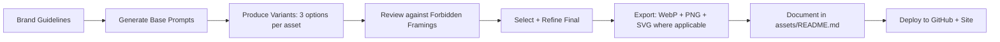

# 🎨 AgenticCareerBoost Visual Branding Strategy

*Aligned with `docs/core/brand.md`, `marketing.md`, and social campaign plan*

---

## 🧭 Brand Foundation Summary

| Element | Specification |
|---------|--------------|
| **Core Positioning** | Systems-minded builder • Agentic workflow designer • Technical generalist with documentation depth |
| **Tone** | Technical, disciplined, direct • Slightly artistic/young energy • Controlled sarcastic edge (public-facing only) |
| **Forbidden** | ❌ AI-influencer hype • ❌ Fake startup noise • ❌ Generic "junior dev" framing • ❌ Self-pity or chaos |
| **Primary Audience** | Recruiters (fast proof of capability) • Engineering peers (visible craft & systems thinking) |
| **Visual Metaphor** | *Self-generating AI tool interface* — clean, data-forward, interactive-feel UI that reflects autonomous career engineering |

---

## 🎨 Visual Identity System

### Color Palette

```yaml
Primary:
  deep_indigo: "#2D3142"      # Technical depth, stability
  electric_blue: "#4F5D75"    # Intelligent systems, flow
  accent_cyan: "#00D4AA"      # Agentic action, precision

Secondary:
  slate_light: "#BFC0C0"      # Documentation, clarity
  warning_orange: "#FF9F1C"   # Strategic provocations (sparingly)
  success_green: "#2EC4B6"    # Verified outcomes

Background:
  dark_mode: "#0F1115"        # Primary UI background
  card_surface: "#1A1D23"     # Component surfaces
  gradient_mesh: "linear-gradient(135deg, #2D3142 0%, #0F1115 100%)"

Text:
  primary: "#F8F9FA"
  secondary: "#ADB5BD"
  code: "#00D4AA"
```

### Typography

```yaml
Headings: "Inter Tight, SF Pro Display, system-ui"  # Clean, technical, modern
Body: "Inter, system-ui, -apple-system"             # Highly readable
Monospace: "JetBrains Mono, Fira Code, monospace"   # Code/agent output styling
Weights: 400 (body), 600 (subheads), 700 (headings), 800 (hero)
```

### Iconography & Visual Language

- **Style**: Minimal line icons with subtle glow effects; isometric 3D for system diagrams
- **Motifs**:
  - Network nodes & connecting paths (agentic workflows)
  - Document stacks with "verified" checkmarks (evidence trail)
  - Terminal windows with animated cursor (active engineering)
  - Abstract "agent brain" with data streams (autonomous reasoning)
- **Avoid**: Cartoonish robots, generic "AI brain" clipart, stock-photo humans

---

## 🖼️ Image Generation Prompt Library

> *All prompts optimized for Midjourney v6+, DALL·E 3, or Stable Diffusion XL. Use `--style raw --ar 16:9` for banners, `--ar 1:1` for social thumbnails.*

### 🔷 GitHub Repository Assets

#### 1. Repository Header Banner (1280×640px)

```prompt
Minimalist tech dashboard interface showing an agentic career workflow system, dark mode UI with deep indigo and electric blue accents, floating nodes connected by glowing cyan data streams, subtle terminal output in background showing "agent: optimizing_profile...", isometric perspective, clean typography "AgenticCareerBoost" in top-left, subtle grid background, professional engineering aesthetic, no people, no logos --style raw --ar 2:1 --no text, people, cartoon
```

#### 2. Workflow Diagram Thumbnail (for README)

```prompt
Isometric technical diagram of a multi-agent system: central orchestrator node connected to specialist agents (Developer, PairCheck, CI/CD, Documentation), each with distinct icon and status indicator, data flowing along labeled paths, dark background with cyan accent lines, minimalist line-art style, subtle glow effects on active nodes, monospace labels, engineering blueprint aesthetic --style raw --ar 4:3 --no people, photorealistic
```

#### 3. "Evidence Trail" Badge Graphic

```prompt
Minimalist badge design: layered document icon with checkmark seal, subtle glow ring in accent cyan, micro-text "verified evidence" along edge, dark slate background, technical line-art style, suitable for GitHub README badge placement, 200x200px visual weight --style raw --ar 1:1 --no text, people
```

#### 4. Sprint Report Cover Template

```prompt
LaTeX-style report cover: minimalist layout with project title "AgenticCareerBoost • Sprint S-001", abstract geometric pattern suggesting data flow in background, deep indigo to black gradient, accent cyan horizontal rule, monospace subtitle "Profile Audit & Positioning", subtle paper texture overlay, professional technical documentation aesthetic --style raw --ar 4:5 --no people, decorative elements
```

---

### 🔷 Recruiters Landing Page Assets

#### 5. Hero Section Visual (Full-width)

```prompt
Modern AI-tool interface hero: floating glass-morphism panels showing career analytics dashboard, real-time agent activity feed ("optimizing resume...", "matching skills..."), subtle animated data particles, dark UI with electric blue and cyan accents, blurred background suggesting depth, clean sans-serif typography space on right for headline, futuristic but professional, inspired by opencode.ai aesthetic --style raw --ar 21:9 --no people, logos, text
```

#### 6. "Agent in Action" Feature Graphic

```prompt
Close-up UI mockup of an autonomous career agent interface: terminal-style output showing step-by-step reasoning ("Analyzing job description...", "Mapping skill gaps...", "Generating tailored summary..."), syntax-highlighted code blocks, progress indicators in accent cyan, dark theme with subtle grid, monospace font, technical but approachable, sense of intelligent automation at work --style raw --ar 16:9 --no people, branding
```

#### 7. "Evidence Portfolio" Grid Visual

```prompt
Grid of 4 minimalist cards showing career artifacts: (1) GitHub commit graph with green streaks, (2) PDF report thumbnail with "verified" badge, (3) skill matrix visualization, (4) workflow diagram snippet, unified dark theme with cyan hover glow, subtle drop shadows, clean spacing, recruiter-friendly clarity, modern dashboard aesthetic --style raw --ar 4:3 --no people, decorative icons
```

#### 8. "Why This Works" Comparison Visual

```prompt
Split-screen technical comparison: left side shows chaotic traditional resume (blurred, generic icons), right side shows structured agentic profile (clean nodes, verified badges, data connections), dividing line in accent cyan, subtle "before/after" label treatment, dark background, minimalist line-art style, emphasizes systems thinking over decoration --style raw --ar 16:9 --no people, photorealistic
```

#### 9. Mobile Landing Page Thumbnail (OG Image)

```prompt
Condensed mobile preview of agentic career interface: hero section with title "AgenticCareerBoost", single agent workflow visualization, key metric cards ("3 verified reports", "12 optimized profiles"), dark mode with cyan accents, clean typography hierarchy, optimized for LinkedIn/Twitter preview, professional technical aesthetic --style raw --ar 1.91:1 --no people, logos
```

---

### 🔷 Social Media Campaign Assets

#### 10. Campaign Kickoff Card (LinkedIn/Twitter)

```prompt
Bold social card: central abstract icon of interconnected nodes forming an upward arrow (career growth), deep indigo background with electric blue gradient glow, minimalist typography space at bottom for headline, accent cyan pulse effect on key node, professional tech aesthetic, optimized for engagement without hype --style raw --ar 1:1 --no people, stock imagery
```

#### 11. "Profile Audit Reveal" Teaser

```prompt
Intriguing technical teaser: blurred dashboard interface coming into focus, highlighted section showing "skill gap analysis" visualization, subtle "coming soon" treatment in monospace font, dark theme with cyan accent line, sense of revealing valuable insight, professional curiosity without clickbait --style raw --ar 4:5 --no people, dramatic lighting
```

#### 12. "Evidence Over Adjectives" Quote Graphic

```prompt
Minimalist quote treatment: monospace text "Evidence over adjectives." centered on dark slate background, subtle animated data stream pattern in background (very low opacity), accent cyan underline beneath quote, small project logo treatment bottom-right, clean and disciplined aesthetic matching brand tone --style raw --ar 1:1 --no people, decorative elements
```

#### 13. UOC Fair Outreach Visual

```prompt
Professional event-ready graphic: clean layout with project name "AgenticCareerBoost", subtle university/tech fair aesthetic (abstract geometric pattern in background), key value props as minimalist icons (verified evidence, agentic workflow, recruiter-ready), dark theme with cyan accents, space for QR code placement, polished but not corporate --style raw --ar 4:3 --no people, stock photos
```

---

### 🔷 Supporting Brand Assets

#### 14. Favicon / App Icon

```prompt
Minimalist abstract mark: interlocking geometric shapes suggesting agent coordination and career progression, single-color version in accent cyan on transparent background, scalable to 16px, clean lines, no text, technical but memorable --style raw --ar 1:1 --no text, people, complex details
```

#### 15. PDF Report Header Graphic

```prompt
LaTeX report header element: subtle horizontal rule with micro-pattern suggesting data flow, project name in monospace small caps, accent cyan vertical marker, minimalist and printable, works in grayscale, professional technical documentation style --style raw --ar 8:1 --no people, color-dependent elements
```

#### 16. "Agent Registry" Visual Index

```prompt
Grid of agent role icons: Orchestrator (central node), Developer (code bracket), PairCheck (dual eyes), CI/CD (pipeline), Documentation (layered pages), each in minimalist line-art with status indicator dot, unified dark theme, subtle glow on active roles, technical directory aesthetic --style raw --ar 3:2 --no people, photorealistic
```

#### 17. Social Profile Banner (LinkedIn/Twitter)

```prompt
Professional social banner: abstract visualization of career trajectory as ascending data path, nodes representing milestones (reports, commits, optimizations), deep indigo background with electric blue gradient, subtle grid overlay, space for profile photo overlap on left, clean and technical without clutter --style raw --ar 3:1 --no people, text, logos
```

#### 18. "Truth Hierarchy" Diagram (for docs)

```prompt
Technical flowchart: layered pyramid showing truth priority (User Prompt → Core Docs → Workflows → Agents → State → Logs), clean line connections, color-coded layers (primary for stable truth, secondary for volatile), monospace labels, dark background with cyan accents, engineering documentation style --style raw --ar 4:3 --no people, decorative elements
```

---

## 🛠️ Implementation Guidelines

### For GitHub README

```markdown
<!-- Use these asset placements -->


[](content/reports/)
```

### For Recruiters Landing Page (`site/`)

```html
<!-- Hero section -->
<section class="hero">
  
  <div class="hero-copy">
    <!-- Headline + CTA -->
  </div>
</section>

<!-- Feature grid -->
<div class="feature-grid">
  <figure>
    
    <figcaption>Autonomous profile optimization</figcaption>
  </figure>
  <!-- ... more features -->
</div>
```

### For Social Media

- **LinkedIn**: Use 1200×627px OG images (prompts #9, #10, #11)
- **Twitter**: Use 1600×900px header + 1200×675px cards
- **Always**: Include alt-text describing the visual for accessibility
- **Never**: Add text overlays to generated images (add in post-production for localization)

---

## 🎯 Quality Control Checklist

Before publishing any visual asset:
- [ ] Does it avoid "AI hype" aesthetics (no glowing brains, robot hands)?
- [ ] Is the technical identity clear without being cold or inaccessible?
- [ ] Does it work in grayscale (for print/PDF fallbacks)?
- [ ] Is there sufficient contrast for accessibility (WCAG AA minimum)?
- [ ] Does it align with the "evidence over adjectives" principle?
- [ ] For public-facing assets: does the sarcastic/artistic edge feel controlled, not chaotic?
- [ ] For core docs: is the visual purely functional with zero decorative noise?

---

## 🔄 Asset Production Workflow



> 💡 **Pro Tip**: Store all source prompts in `assets/prompts/` with version control. This creates an auditable trail for future iterations and allows agents to regenerate assets if formats change.

---

## 📦 Missing Assets You Might Need

Based on the project structure and campaign plan, also consider generating:

| Asset | Purpose | Prompt Reference |
|-------|---------|-----------------|
| `assets/diagrams/truth-hierarchy.svg` | Visual for docs/core | #18 |
| `assets/social/campaign-timeline.png` | Social plan visualization | Custom: timeline with campaign phases |
| `assets/landing/recruiter-cta-banner.png` | Final conversion section | Variation of #5 with CTA space |
| `assets/badges/sprint-status-{active,closed}.png` | Workflow state indicators | Miniature version of #3 |
| `assets/social/research-card-template.png` | For SocialMediaPlanner outputs | #10 + data visualization overlay |

---

> ✨ **Final Note**: This visual system is designed to *demonstrate* the agentic engineering discipline it promotes. Every asset should feel like a deliberate, evidence-backed choice — not decoration. When in doubt, simplify, clarify, and let the work speak.

Ready to generate? Start with the **Repository Header Banner** (#1) and **Hero Section Visual** (#5) as foundation assets, then expand outward. 🚀
