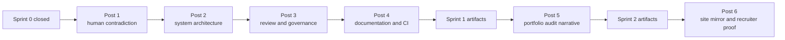

# Integrated Communication Campaign Report for AgenticCareerBoost

## Executive summary

The repository on entity["organization","GitHub","developer platform"] is not merely a portfolio repo. It is explicitly designed as a public engineering campaign: the repository is the operational source of truth, the site is the public mirror, and entity["company","LinkedIn","professional network"] is the selective distribution layer. Sprint S-000 closed on 2026-04-19 after delivering LaTeX reporting infrastructure, a formal bootstrap document, CI workflows, a LinkedIn landscape research file, a style book, and three kickoff-post options; the roadmap then seeds S-001 through S-004, but only as high-level titles, not yet as detailed task contracts. citeturn41view5turn13view1turn13view2turn9view0turn8view8turn9view2

The key communication problem is therefore not “write a better first post.” The repo already contains three evidence-backed first-post seeds, a coherent public-voice system, and an internal recommendation to sequence the options A → B → C. The real unresolved gap is campaign continuity: the backlog still leaves publication cadence, scheduling tooling, A/B tracking, “series versus standalone,” and network seeding open, while the style book explicitly says every sprint closure should produce at least one narrative candidate and that the same kernel should become different expressions across repo, site, and social. citeturn19view0turn15view0turn15view1turn9view1turn30view0turn30view6

The strongest overall answer is a hybrid sequence: start with the human contradiction and the system’s purpose, move immediately into artifact proof, then introduce the sharper contrarian voice only after credibility is visible. In practice, that means using a campaign rather than a single “hero” post: Posts 1–2 should exploit Sprint 0’s existing evidence, Posts 3–4 should surface governance and automation, and Posts 5–6 should bridge into S-001 and S-002 as soon as those artifacts exist. citeturn19view0turn31view2turn23view0turn23view2turn9view2

## What Sprint 0 gives you and what it still does not

Sprint 0 produced an unusually strong communications spine for a cold-start technical profile. The repo already has a public mission, a defined audience hierarchy, a tone system, a routing entrypoint, workflow contracts, output templates, CI pipelines, a formal engineering document source, and draft social content. That is a rare advantage: the campaign can point to inspectable operating artifacts rather than generic “learning in public” rhetoric. At the same time, several public-facing surfaces are not yet synchronized, some visuals are still placeholders, and future sprint details remain unspecified. citeturn41view5turn43view0turn13view0turn13view1turn13view2turn9view0turn15view0

| Finding | Why it matters for the campaign |
|---|---|
| **Strong evidence spine**: `README.md`, `AGENTS.md`, `docs/core/*`, `docs/workflows/*`, `docs/agents/*`, `docs/templates/*`, `state/*`, `content/*`, `site/starter/*`, and `data/*` are all explicitly mapped as parts of the system. citeturn41view5turn43view0turn31view5 | You can make claims first and support them immediately with files, diagrams, workflows, or generated docs. |
| **Governance is a differentiator**: the system enforces a dispatcher-only Orchestrator, one-task-per-agent execution, two fresh PairCheck reviewers, a remediation loop, six required sprint closure artifacts, five issue templates, and a PR template that checks for social, documentation, and backlog traces. citeturn29view11turn31view2turn30view1turn38view0turn39view0 | This is one of the best narrative hooks in the repo because it proves judgment, not just experimentation. |
| **Artifact-first storytelling is already supported**: the LaTeX toolchain includes a shared preamble, safe image inclusion, TikZ style libraries, local build scripts, and a workflow that compiles reports and uploads PDFs as artifacts. citeturn16view0turn23view0turn23view3turn23view4turn23view5 | You can support the campaign with native documents, diagrams, and exportable technical visuals instead of text-only posts. |
| **The public mirror is not fully trustworthy yet**: `README.md` says the next sprint seed is S-001 and the current workflow is none, `state/current.md` says S-000 is closed and ready for Plan or Chat, `site/starter/index.md` still says “Ready for first sprint,” and `data/public-status.json` incorrectly lists the next sprint seed as S-000. citeturn41view5turn8view8turn35view0turn34view0 | If you post before syncing these surfaces, the campaign risks looking performative rather than precise. |
| **Visual readiness is incomplete**: the Sprint 0 LaTeX report still contains screenshot placeholders, the backlog explicitly tracks replacing them, and both `assets/` and `content/reports/tex/figures/screenshots/` are effectively empty. citeturn26view2turn9view1turn24view2turn33view3 | A serious technical campaign should launch with real visuals, not with placeholders or decorative stock media. |
| **The repo is a system showcase, not an application showcase**: there is no visible experiments folder or runnable product module in the public tree; the showcase is the operating system itself, plus its site and documents. Open issues and PRs are both zero, and no releases are published. citeturn41view5turn43view0 | The campaign should lean into “workflow architecture as portfolio,” not pretend that this is a traditional app launch. |
| **Some provenance is unclear**: the style book cites `bootstrap/user_data.md`, but the public `bootstrap/` directory listing only shows `agent_bootstrap_prompt.md` and `repo_starter_pack.md`. citeturn13view5turn33view4 | Any claims derived from personal-priority mapping should be treated as internally intended, but publicly unspecified unless that file is added or referenced elsewhere. |

## Overall recommended hybrid plan

The best campaign is a **narrative-to-proof-to-perspective** hybrid: use a human opening to earn attention, use architecture and documentation to earn trust, and only then use a sharper, more contrarian voice to become memorable. This recommendation aligns with the repo’s audience order, style rules, and the internal Sprint 0 recommendation that Option A should lead, Option B should follow as proof, and Option C should be reserved until the audience already knows the system. citeturn13view1turn15view0turn19view0

This structure also respects the repo’s own communication constraints: LinkedIn is the primary social channel, the preferred cadence is Tuesday narrative plus Thursday technical artifact, links should live in the first comment rather than the body, visuals should be diagrams/documents/screenshots rather than selfies, and public content must never clone the same text used elsewhere. citeturn15view0turn15view1turn30view0turn30view6

Before Post 1, four launch gates should be treated as mandatory:

| Launch gate | Why it should block launch |
|---|---|
| **Sync `README.md`, `state/current.md`, `data/public-status.json`, and `site/starter/index.md`** | Without this, the campaign makes precision a claim while the public surfaces show drift. |
| **Generate real visuals for the repo tree, Actions runs, and one architecture flow** | Sprint 0 already knows screenshots are missing; launching without them weakens the proof posture. |
| **Produce a downloadable or attachable S-000 PDF teaser** | The repo has the LaTeX source and CI build path, but the document-led campaign only works if readers can actually inspect the artifact. |
| **Clean stale draft references in the kickoff options** | Some draft notes still speak in future tense despite Sprint 0 being closed, which makes them look unfinished if reused directly. |

The draft options file itself still contains stale references such as “compiled PDF available as CI artifact after first push” and “Sprint contract … will be populated during sprint execution,” even though Sprint 0 is already marked closed. That is a fixable editorial issue, but it is also a signal: the current materials are excellent **inputs** to a campaign, not final campaign assets as-is. citeturn18view1turn9view0

## Plan Alpha

This is the strongest recruiter-first plan. It takes the repo’s stated audience priority seriously, follows the style book’s preferred cadence, and expands Sprint 0’s internally recommended Option A into a six-post sequence that gradually reveals more engineering depth without overwhelming a cold audience on day one. It is the safest plan if the primary success condition is recruiter discovery plus peer respect, rather than debate or pure documentation reach. citeturn13view1turn15view0turn18view1turn19view0

**Objective:** turn the career pivot into a visible systems-engineering case study.

**Target audience segments:** recruiters and hiring managers first; engineering peers second; career changers and students as a tertiary audience.

**Timing:** six posts over three weeks, using the repo’s Tuesday/Thursday rhythm. Posts 1–4 can run immediately from existing Sprint 0 artifacts. Posts 5–6 should be published only when S-001 and S-002 create visible repo or site evidence; until then, those positions stay reserved. citeturn15view0turn9view2

| Post | Roadmap anchor | Content outline, hook, and attachment | CTA | Length |
|---|---|---|---|---|
| **Post 1** | Sprint 0 closure | **Hook:** “I did not write a career-change manifesto. I built a system for one.” Outline: personal contradiction, why the repo exists, architecture-as-portfolio thesis. **Attachment:** generated routing/architecture diagram based on README + `AGENTS.md`. | Ask peers what the most unusual system is that they built for a non-software problem. | 1,100–1,300 chars |
| **Post 2** | Sprint 0 architecture | **Hook:** “The most important file is not code. It is the routing table.” Outline: path-based routing, model-agnostic design, why no mega-prompt. **Attachment:** screenshot of `AGENTS.md` plus a tiny mermaid routing diagram. | Ask whether they trust file-routed orchestration more than giant prompts. | 950–1,150 chars |
| **Post 3** | Sprint 0 governance | **Hook:** “No self-approval allowed.” Outline: Orchestrator/Developer/PairCheck split, two fresh reviewers, remediation loop, human approval boundary. **Attachment:** generated sprint-review flowchart from `docs/workflows/sprint.md`. | Ask what review rule they would keep if all AI assistance vanished tomorrow. | 1,000–1,250 chars |
| **Post 4** | Sprint 0 documentation | **Hook:** “The documentation is part of the build, not the cleanup.” Outline: formal LaTeX report, TikZ diagrams, safe screenshots, why docs are evidence. **Attachment:** native PDF teaser from the S-000 report, ideally 3–5 pages. | Ask how much formal documentation belongs in personal engineering work. | 900–1,150 chars |
| **Post 5** | Sprint 1 bridge | **Hook:** “Sprint 1 is where the system stops describing itself and starts auditing my portfolio.” Outline: how S-001 converts vague ‘positioning’ into inspectable criteria. **Attachment:** roadmap panel + active-sprint screenshot once available. | Ask recruiters what proofs matter most in a portfolio audit. | 900–1,100 chars |
| **Post 6** | Sprint 2 bridge | **Hook:** “A portfolio is only useful when a hiring team can scan it fast.” Outline: why S-002 site rebuild matters, what the recruiter landing page should contain, what AI-readable metadata should signal. **Attachment:** current site home screenshot and planned site-block mockup. | Ask hiring managers what they expect to find in the first 30 seconds on a candidate site. | 850–1,100 chars |

**Recommended KPIs:** treat these as operating targets, not forecasts. They are best read as campaign goals extrapolated from the repo’s draft KPI bands and cadence guidance. citeturn18view1turn18view3turn18view4turn15view0

| Metric | Operating target |
|---|---|
| Total campaign impressions over 30 days | 6,000–10,000 |
| Average engagement rate | 3.8%–4.8% |
| Profile visits | 180–320 |
| Repo or site visits from first-comment links | 120–240 |
| Substantive comments | 18–35 |
| Recruiter conversations | 3–6 |

| Risk | Why it is real | Mitigation |
|---|---|---|
| The “none in tech” line triggers bias | Draft Option A itself flags this risk. citeturn19view0 | Pair the line immediately with operations proof, systems scale, and repo evidence; never leave the vulnerability unsupported. |
| Middle-post density becomes too technical | Recruiters are the primary audience, but peers will read the details. citeturn13view1 | Use arrow-point structure, one visual, and one proof link; keep the body scannable. |
| Public-status drift damages trust | README, site, and JSON disagree today. citeturn41view5turn35view0turn34view0 | Fix all status surfaces before Post 1 and again before each roadmap-bridge post. |
| Cold-start feed penalizes reach | The repo is at zero stars/forks/watchers and has no existing public issue/release activity. citeturn41view5turn43view0 | Seed the first two posts intentionally through known communities and close contacts rather than relying on ambient discovery. |

**Sample LinkedIn hooks for Posts 1–3**

| Post | Sample hook |
|---|---|
| **Post 1** | I did not want my career change to sound brave. I wanted it to become inspectable, so I built the operating system that now runs it in public. |
| **Post 2** | Most “agentic” examples start with a monster prompt. Mine starts with a routing file, because architecture should decide context before the model ever speaks. |
| **Post 3** | I do not let this system approve its own work. Every non-trivial output goes through two fresh reviewers, because the point is proof, not optimism. |

## Plan Beta

This is the strongest artifact-first plan. It assumes the audience will reward seriousness, documentation quality, and technical inspectability more than personality-led discovery. It expands the repo’s Option B logic into a documentation campaign that makes the formal report, workflows, templates, and CI visible as the campaign itself. This is the best plan if the main goal is to attract engineering peers, technically literate hiring managers, or teams that value writing quality and systems design discipline. citeturn18view2turn18view3turn15view0turn30view7

**Objective:** position the repo as a technical case study whose artifacts can withstand inspection.

**Target audience segments:** engineering peers first; technical hiring managers second; recruiters third.

**Timing:** also six posts over three weeks, but only after the PDF teaser and at least one polished architecture visual are ready. Because this plan leans so heavily on native documents and screenshots, visual readiness is a real dependency rather than a nice-to-have. citeturn23view0turn26view2turn24view2

| Post | Roadmap anchor | Content outline, hook, and attachment | CTA | Length |
|---|---|---|---|---|
| **Post 1** | Sprint 0 closure | **Hook:** “This is the actual engineering document.” Outline: reveal the S-000 report as a native document upload, frame it as the public proof package. **Attachment:** native PDF teaser or full document upload. | Ask what makes technical documentation worth reading beyond the author. | 950–1,150 chars |
| **Post 2** | Sprint 0 architecture | **Hook:** “If you only read three files, read these.” Outline: README, `AGENTS.md`, and `state/current.md` as the repo’s minimal reading path. **Attachment:** three-file skimmable screenshot panel. | Ask which file they would open first to audit the system. | 850–1,050 chars |
| **Post 3** | Sprint 0 governance | **Hook:** “The most valuable feature is the truth hierarchy.” Outline: conflict resolution, context budget, volatility containment, why small files beat giant prompts. **Attachment:** truth-hierarchy card or flowchart. | Ask how they prevent conflicting instructions in their own systems. | 950–1,150 chars |
| **Post 4** | Sprint 0 report/toolchain | **Hook:** “The report is built by the system it describes.” Outline: LaTeX preamble, TikZ, safe image placeholders, `build-local.sh`, and CI compilation. **Attachment:** one-page toolchain image or preamble diagram. | Ask whether they treat documentation toolchains as first-class engineering. | 900–1,150 chars |
| **Post 5** | Sprint 0 automation | **Hook:** “Proof should compile.” Outline: docs-lint, link validation, PDF artifact upload, status export, site build. **Attachment:** GitHub Actions screenshot with all pipeline names visible. | Ask which automated check gives them the most confidence in human-authored docs. | 900–1,100 chars |
| **Post 6** | Sprint 1–2 bridge | **Hook:** “The next phase is not more content. It is better retrieval.” Outline: S-001 portfolio audit and S-002 site rebuild as attempts to convert dense repo truth into recruiter-readable surfaces. **Attachment:** site homepage + project-page placeholder mock. | Ask what should be visible on a recruiter landing page before a repo link is ever clicked. | 900–1,150 chars |

**Recommended KPIs:** this plan optimizes for saves, downloads, and technical comments more than broad emotional reach. The targets below are an inference from the repo’s document-led draft and style-book logic. citeturn18view2turn18view3turn15view0

| Metric | Operating target |
|---|---|
| Total campaign impressions over 30 days | 5,000–9,000 |
| Average engagement rate | 4.0%–5.0% |
| PDF opens or downloads | 80–200 |
| Saves | 30–60 |
| Technical comments | 15–30 |
| Recruiter conversations | 2–4 |

| Risk | Why it is real | Mitigation |
|---|---|---|
| The campaign reads as too academic | Option B already notes lower emotional accessibility. citeturn18view3 | Pair each artifact post with a one-sentence human reason: why this file exists and what problem it solved for you. |
| Recruiters will not open a dense document | The repo’s own draft warns that non-technical readers may skip the PDF. citeturn18view3 | Use a teaser PDF or 3–5 page excerpt first, with a “read this first” framing in the first comment. |
| Missing screenshots weaken visual credibility | Sprint 0 still carries placeholder screenshot debt. citeturn26view2turn9view1 | Generate a minimal, consistent visual kit before launch: file tree, Actions run, routing map, and one report spread. |
| Future roadmap posts overpromise | S-001 and S-002 details are still only seed titles. citeturn9view2 | Phrase bridge posts around objectives and criteria, not around detailed deliverables that do not yet exist. |

**Sample LinkedIn hooks for Posts 1–3**

| Post | Sample hook |
|---|---|
| **Post 1** | This is not a deck about AI. It is the actual engineering document for the system I am using to rebuild my public technical profile. |
| **Post 2** | If you only opened three files in this repo, you could still understand what it is trying to prove. That is not an accident; it is the architecture. |
| **Post 3** | The hardest problem in a multi-agent repo is not generation. It is deciding what counts as true when the files disagree. |

## Plan Gamma

This is the highest-variance plan. It is built from the repo’s Option C logic and the brand rule that a controlled sarcastic or provocative edge is allowed in public artifacts, so long as it targets systems rather than people and is immediately backed by substance. This plan is powerful for memorability, but it should not be the opening move unless you are deliberately optimizing for sharp positioning over low-risk discovery. citeturn13view0turn15view0turn18view4turn19view0

**Objective:** differentiate yourself from generic AI commentary by making public proof, cost transparency, and review discipline the center of the narrative.

**Target audience segments:** engineering peers first; technically curious hiring managers second; recruiters third.

**Timing:** use this plan only after at least one narrative-led or artifact-led post has already established baseline credibility. The repo’s own internal recommendation explicitly suggests holding the contrarian voice until later in the sequence. citeturn19view0

| Post | Roadmap anchor | Content outline, hook, and attachment | CTA | Length |
|---|---|---|---|---|
| **Post 1** | After one prior proof post | **Hook:** “I am not trying to become an AI influencer.” Outline: contrast hype with a working public system, then immediately show the repo and what it controls. **Attachment:** repo architecture card. | Ask what signals separate tooling from theater in AI-assisted engineering. | 1,000–1,200 chars |
| **Post 2** | Sprint 0 tools | **Hook:** “Interesting systems are built from constraints, not subscriptions.” Outline: free-tier stack, tool policy, model agnosticism, anti-lock-in principle. **Attachment:** tool stack visual from `tool-policy.md`. | Ask what tool they would remove first if forced to keep only free infrastructure. | 900–1,100 chars |
| **Post 3** | Sprint 0 governance | **Hook:** “If your agent can approve itself, you do not have governance.” Outline: PairCheck freshness, defect-only remediation, human publication approval. **Attachment:** governance flowchart. | Ask what minimum review rule is non-negotiable for AI-assisted work. | 950–1,150 chars |
| **Post 4** | Sprint 0 architecture | **Hook:** “A prompt is not an architecture.” Outline: path-based routing, truth order, conflict containment, auditability. **Attachment:** `AGENTS.md` screenshot + truth-hierarchy card. | Ask whether readers optimize more for prompt cleverness or topology. | 950–1,150 chars |
| **Post 5** | Sprint 0 honesty post | **Hook:** “The point of building in public is that the rough edges stay visible.” Outline: public-status drift, screenshot placeholders, unresolved cadence decisions, and why leaving such gaps visible is better than pretending they do not exist. **Attachment:** before/after sync visual once fixed. | Ask what kind of imperfection still increases trust when shared honestly. | 1,000–1,250 chars |
| **Post 6** | Sprint 1–4 bridge | **Hook:** “The next proof is not another opinion. It is whether the system can produce recruiter-readable outcomes.” Outline: S-001 through S-004 as conversion from internal rigor to public legibility. **Attachment:** roadmap graphic with explicit “details still unspecified” note. | Ask what outcome would convince them the experiment is working. | 900–1,100 chars |

**Recommended KPIs:** this plan should create more comments and stronger peer-level discussion than Plan Alpha or Beta, but it will usually convert more slowly with recruiters. Those trade-offs are also consistent with the repo’s own Option C framing. citeturn18view4turn19view0

| Metric | Operating target |
|---|---|
| Total campaign impressions over 30 days | 4,500–8,500 |
| Average engagement rate | 3.8%–4.8% |
| Comment volume | 25–45 |
| Shares or reposts | 8–18 |
| Repo visits | 140–260 |
| Recruiter conversations | 1–3 |

| Risk | Why it is real | Mitigation |
|---|---|---|
| The tone sounds combative | The style-book itself warns that sharpness must be controlled and limited to once per post. citeturn15view0 | Use one sharp line, then pivot immediately to architecture, process, or evidence. |
| Debate overwhelms proof | Contrarian posts attract opinions faster than inspection. | Keep every CTA narrow and engineering-specific; do not ask for broad “thoughts.” |
| Early posts may feel gimmicky | The repo’s internal draft calls Option C high-variance and better reserved for later. citeturn19view0 | Do not open the campaign with this plan unless you have already built audience recognition elsewhere. |
| Honest discussion of gaps reads as weakness | Surface drift and placeholders are real. citeturn34view0turn35view0turn26view2 | Share gaps only alongside a clear fix, a date, or a workflow rule that explains why the problem is visible. |

**Sample LinkedIn hooks for Posts 1–3**

| Post | Sample hook |
|---|---|
| **Post 1** | I am not trying to sound fluent in AI. I am trying to make my engineering harder to dismiss. |
| **Post 2** | The most interesting part of this system is not the model. It is the fact that the architecture still works when the model changes. |
| **Post 3** | If an agent can review itself, the only thing you automated was confidence. I would rather automate friction and keep the trust. |

## Repo-to-post artifact map and visual generation brief

The mapping below uses the repo’s canonical file map, routing entrypoint, state model, core docs, workflows, templates, LaTeX infrastructure, CI workflows, status export, site mirror, and Sprint 0 social artifacts. The point is not to turn every file into content; it is to let each post prove exactly one useful thing. citeturn41view5turn43view0turn31view2turn9view0turn15view0turn23view0turn23view1turn23view2

| Repo file or artifact | Best-fit posts | Narrative hook | Message purpose |
|---|---|---|---|
| `README.md` architecture and repository map | A1, A6, B2, G4 | “This is not a repo dump; it is a structured operating system.” | Orient new readers fast and demystify the project. |
| `AGENTS.md` | A2, B2, G4 | “Routing beats mega-prompts.” | Show path-based orchestration, model agnosticism, and auditability. |
| `docs/core/mission.md` + `docs/core/marketing.md` | A1, A6, B6, G6 | “The system exists to convert real capability into readable proof.” | Tie the engineering system to career outcomes without sounding generic. |
| `docs/core/brand.md` + `content/social/style-book.md` | All plans | “Professional, evidence-first, slightly sharp.” | Keep voice disciplined while allowing curiosity and controlled edge. |
| `docs/core/truth-hierarchy.md` | A2, B3, G4 | “Conflicts are resolved structurally, not rhetorically.” | Make governance and context-control part of the public story. |
| `docs/agents/orchestrator.md`, `developer.md`, `paircheck.md`, `docs/workflows/sprint.md` | A3, B3, G3 | “No self-approval, no hidden reviewer overlap.” | Demonstrate engineering maturity in workflow design. |
| `docs/templates/community-output.md`, `documentation-output.md`, `sprint-output.md`, `paircheck-output.md` | A3, B4, G3 | “The system templates its own proof.” | Show that output quality is standardized, not improvised. |
| `content/reports/tex/*` and `content/reports/tex/sprints/s000-agentic-os-bootstrap.tex` | A4, B1, B4, G5 | “Documentation is a first-class artifact.” | Support document-led and diagram-led posts with credible source material. |
| `.github/workflows/docs-lint.yml` + `scripts/validate-links.sh` | A5, B5, G2 | “Claims should link and compile.” | Turn documentation QA into a trust signal. |
| `.github/workflows/latex-build.yml` | A4, B1, B4 | “Proof should export automatically.” | Show that the formal artifact is not manually staged theater. |
| `.github/workflows/export-status.yml`, `.github/workflows/site-build.yml`, `data/public-status.json`, `site/starter/index.md` | A6, B5, B6, G5 | “Public mirror, machine-readable state, deployable surface.” | Explain how repo truth becomes public representation, while also exposing sync risk. |
| `.github/ISSUE_TEMPLATE/*` + `PULL_REQUEST_TEMPLATE.md` | A5, G3 | “Even intake and closure are formalized.” | Show governance readiness even though live issue traffic is absent. |
| `content/social/drafts/2026-04-s000-kickoff-options.md` | All plans | “Good first-post seeds, not enough campaign structure.” | Reuse the repo’s strongest copy fragments without inheriting one-post limitations. |
| `content/social/research/2026-04-linkedin-career-agentic-landscape.md` + `content/social/style-book.md` | All plans | “The campaign has its own research and rules.” | Justify cadence, hook style, and format choices. |
| `state/roadmap.md`, `state/backlog.md`, `state/current.md` | A6, B6, G6 | “The story moves because the roadmap moves.” | Tie the communication sequence to future sprints rather than to motivational posting. |

Generate the following visual set **before** publication. The repo’s own style rules strongly prefer diagrams, PDFs, and contextual screenshots over decorative imagery, and the current public snapshot still shows unresolved placeholder debt. citeturn15view0turn26view2turn24view2turn33view3

| Visual to generate | Based on repo source | Format | Best use |
|---|---|---|---|
| **Routing architecture diagram** | README architecture + `AGENTS.md` + S-000 report | SVG, PNG, PDF | Cover visual for A1, B2, G4 |
| **Sprint execution and PairCheck loop** | `docs/workflows/sprint.md` + `docs/agents/orchestrator.md` + `paircheck.md` | Mermaid → SVG/PNG | Governance visual for A3, B3, G3 |
| **S-000 document teaser** | `content/reports/tex/sprints/s000-agentic-os-bootstrap.tex` | Native PDF upload + PNG excerpts | Main asset for A4 and especially B1 |
| **GitHub Actions pipeline screenshot** | docs-lint, latex-build, export-status, site-build workflows | PNG with callouts | Proof-loop visual for A5, B5, G2 |
| **Repo tree screenshot** | root file tree | PNG | Companion visual for A1 and B2 |
| **Synced status surface screenshot** | README status + site home + public-status JSON after correction | PNG | Trust-building visual for A6, B6, G5 |
| **Recruiter landing-page wireframe** | `site/starter/index.md`, `site/starter/projects/index.md`, roadmap S-002 | Mermaid, Figma-like mock, or clean Markdown screenshot | Bridge visual for A6 and B6 |

Two caveats should remain explicit in any planning deck or launch checklist. First, Sprint S-001 through S-004 are presently roadmap seeds only, so any post tied to their future output must be labeled provisional until `state/active-sprint.md` or visible repo/site artifacts exist. Second, the style book references `bootstrap/user_data.md`, but that source was not visible in the public snapshot, so copy derived from that personal-priority layer should be treated as internal intent rather than public evidence unless the file is surfaced or the same content is duplicated elsewhere. citeturn9view2turn33view4turn13view5